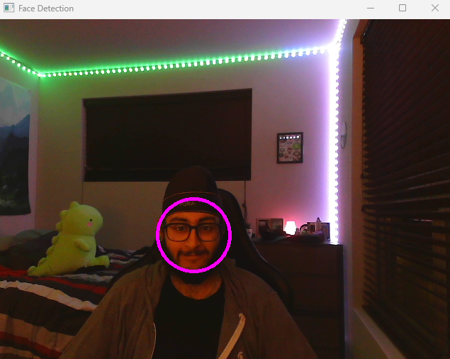

# Exploring Computer Vision with OpenCV and C++


## Table of Contents
- [Introduction](#introduction)
- [Installation](#installation)
  - [Windows](#windows)
- [Object Detection](#object-detection)


## Introduction
OpenCV is a powerful open source computer vision and machine learning library. Originally developed by Intel, it was later supported by Willow Garage then Itseez (which was later acquired by Intel). The library is cross-platform and free for use.

OpenCV was designed for computational efficiency and with a strong focus on real-time applications. Written in optimized C/C++, the library can take advantage of multi-core processing. Enabled with OpenCL, it can take advantage of the hardware acceleration of the underlying heterogeneous compute platform.

Adopted all around the world, OpenCV has more than 47 thousand people of user community and estimated number of downloads exceeding 14 million. Usage ranges from interactive art, to mines inspection, stitching maps on the web or through advanced robotics.

Today we will be exploring the basics of OpenCV and how to use it with C++. We'll be developing a Face Detection algorithm. Face detection is a fundamental task in computer vision that involves locating and identifying human faces in images or video streams. It has a wide range of applications, from photography and video analysis to security systems and facial recognition.


## Installation

### Windows
- Download the latest version of OpenCV from [here](https://opencv.org/releases.html)
- Download the latest version of CMake from [here](https://cmake.org/download/)
- Extract the zip file to a folder
- Add the path to the bin folder to the environment variable
- Add the path to the lib folder to the environment variable
- Open CLion and create a new project
- Add the following lines to the CMakeLists.txt file
```
cmake_minimum_required(VERSION 3.26)
project(Blog)

set(CMAKE_CXX_STANDARD 17)

find_package(OpenCV REQUIRED)

set(SOURCE_FILES main.cpp)

add_executable(Blog ${SOURCE_FILES})

target_link_libraries(Blog PRIVATE ${OpenCV_LIBS})
```
- Create a new file called main.cpp and add the following lines
```
#include <stdio.h>
#include <opencv2/opencv.hpp>

int main(int argc, char** argv )
{

    cv::Mat image;
    image = cv::imread("C:/Users/rajme/Desktop/Rajmeet/MSU/Comp Science/CSE 491 - C++ Capstone/Blog/banana.jpeg");
    if ( !image.data )
    {
        printf("No image data \n");
        return -1;
    }
    namedWindow("Display Image", cv::WINDOW_AUTOSIZE );
    imshow("Display Image", image);
    cv::waitKey(0);
    return 0;
}
```
- Run the project and you should see the image

## Object Detection
#### What is Object Detection?
Object detection is a computer vision technique that allows us to identify and locate objects in an image or video. With this kind of identification and localization, object detection can be used to count objects in a scene and determine and track their precise locations, all while accurately labeling them.

#### Applications of Object Detection
Object detection has many applications, including:
- Object Tracking
- Security Systems
- Autonomous Vehicles


#### How can we detect objects in images?
There are many different algorithms that can be used to detect objects in images. Some of the most popular algorithms are:
- Haar Cascades
- Deep Learning
- Histogram of Oriented Gradients (HOG)

We'll be using Haar Cascades for this project. Haar Cascade classifiers are an effective way for object detection. This method was proposed by Paul Viola and Michael Jones in their paper Rapid Object Detection using a Boosted Cascade of Simple Features in 2001. It is a machine learning based approach where a cascade function is trained from a lot of positive and negative images. It is then used to detect objects in other images.

#### Features and Training
Each feature is a single value obtained by subtracting sum of pixels under the white rectangle from sum of pixels under the black rectangle.


**Training**
- It is possible to train it on whatever we want, but OpenCV already contains many pre-trained classifiers for face, eyes, smile etc.
- We will be using the face classifier for this project
- The training process is very time consuming and requires a lot of positive and negative images
- 

#### CODE
```
#include <iostream>
#include <opencv2/opencv.hpp>
#include <opencv2/objdetect.hpp>
#include <opencv2/highgui.hpp>
#include <opencv2/imgproc.hpp>
#include <opencv2/videoio.hpp>

cv::CascadeClassifier face_cascade;

void faceDetection(cv::Mat frame)
{
    cv::Mat frame_gray;

    // Convert to gray so that we don't have to deal with color and reduce computation time
    cv::cvtColor(frame, frame_gray, cv::COLOR_BGR2GRAY);

    // Detect faces
    std::vector<cv::Rect> faces;
    face_cascade.detectMultiScale(frame_gray, faces);

    for (auto & face : faces)
    {
        cv::Point center(face.x + face.width/2, face.y + face.height/2);
        cv::ellipse(frame, center, cv::Size(face.width/2, face.height/2), 0, 0, 360, cv::Scalar(255, 0, 255), 4);

        cv::Mat faceROI = frame_gray(face);
    }

    cv::imshow("Face Detection", frame);
}

int main()
{
    std::string faceClassifierPath = R"(C:\opencv\sources\data\haarcascades\haarcascade_frontalface_alt.xml)";

    if (!face_cascade.load(faceClassifierPath))
    {
        std::cout << "Error loading face classifier" << std::endl;
        return -1;
    }

    std::cout << "Face classifier loaded successfully" << std::endl;


    cv::VideoCapture cap(1);

    if (!cap.isOpened())
    {
        std::cout << "Error opening camera" << std::endl;
        return -1;
    }

    cv::Mat frame;
    while (cap.read(frame))
    {
        if (frame.empty())
        {
            std::cout << "Error reading frame" << std::endl;
            break;
        }

        faceDetection(frame);

        if (cv::waitKey(10) == 'q')
        {
            break;
        }
    }

    return 0;
}
```

#### Output


