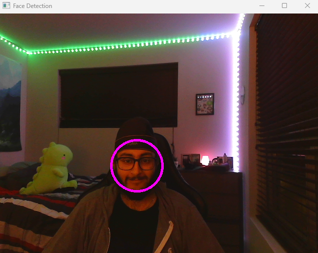

# Exploring Computer Vision with OpenCV and C++


## Table of Contents
- [Introduction](#introduction)
- [Installation](#installation)
    - [Windows](#windows)
    - [Mac](#mac)

- [Object Detection](#object-detection)
    - [What is Object Detection?](#what-is-object-detection)
    - [Applications of Object Detection](#applications-of-object-detection)
    - [How can we detect objects in images?](#how-can-we-detect-objects-in-images)
    - [Haar Cascades](#haar-cascades)
    - [Features and Training](#features-and-training)
    - [Code](#code)
    - [Output](#output)

- [References](#references)

## Introduction
OpenCV is a powerful open source computer vision and machine learning library. Originally developed by Intel, it was later supported by Willow Garage then Itseez (which was later acquired by Intel). The library is cross-platform and free for use.

OpenCV was designed for computational efficiency and with a strong focus on real-time applications. Written in optimized C/C++, the library can take advantage of multi-core processing. Enabled with OpenCL, it can take advantage of the hardware acceleration of the underlying heterogeneous compute platform.

Adopted all around the world, OpenCV has more than 47 thousand people of user community and estimated number of downloads exceeding 14 million. Usage ranges from interactive art, to mines inspection, stitching maps on the web or through advanced robotics.

Today we will be exploring the basics of OpenCV and how to use it with C++. We'll be developing a Face Detection algorithm. Face detection is a fundamental task in computer vision that involves locating and identifying human faces in images or video streams. It has a wide range of applications, from photography and video analysis to security systems and facial recognition.


## Installation

### Windows
- Download the latest version of OpenCV from [here](https://opencv.org/releases)
- Download the latest version of CMake from [here](https://cmake.org/download/)
- Extract the zip file to a folder
- Add the path to the bin folder to the environment variable
- Add the path to the lib folder to the environment variable
- Open CLion and create a new project
- Add the following lines to the CMakeLists.txt file

### Mac
- Download the latest version of OpenCV from [here](https://opencv.org/releases)
- Download the latest version of CMake from [here](https://cmake.org/download/)
- Install the dmg package and launch it from Applications.
- From the CMake app window, choose menu Tools –> How to Install For Command Line Use. Then, follow the instructions from the pop-up there.
- Install folder will be /usr/bin/ by default, submit it by choosing Install command line links.
- Open CLion and create a new project
- Add the following lines to the CMakeLists.txt file

```cmake
cmake_minimum_required(VERSION 3.26)
project(Blog)

set(CMAKE_CXX_STANDARD 17)

find_package(OpenCV REQUIRED)

set(SOURCE_FILES main.cpp)

add_executable(Blog ${SOURCE_FILES})

target_link_libraries(Blog PRIVATE ${OpenCV_LIBS})
```
- To ensure that OpenCV is installed and working correctly, we will try to display an image.
- Create a new file called main.cpp and add the following lines.
```cpp
#include <stdio.h>
#include <opencv2/opencv.hpp>
#include <string>

int main(int argc, char** argv )
{
    // Declare a variable to hold the image
    cv::Mat image;

    // TODO: Provide the path to the image you want to load
    const std::string filename = "TODO: Path to image";
    image = cv::imread(filename);

    // Check if the image data was loaded successfully
    if ( !image.data )
    {
        // Print an error message if the image data is not available
        printf("No image data \n");
        return -1;
    }

    // Create a window with the name "Display Image" and set its size automatically
    namedWindow("Display Image", cv::WINDOW_AUTOSIZE );

    // Display the loaded image in the created window
    imshow("Display Image", image);

    // Wait for a key press event (0 means wait indefinitely)
    cv::waitKey(0);

    return 0;
}

```
- Run the project, and you should see the image displayed in a window

### Possible Errors
- If you get an error saying that the program can't start because opencv_worldXXX.dll is missing from your computer, you need to add the path to the bin folder to the environment variable
- If you get an error saying that the program can't start because MSVCP140D.dll is missing from your computer, you need to install the Visual C++ Redistributable for Visual Studio. You can download it from [here](https://www.microsoft.com/en-us/download/details.aspx?id=48145)

## Object Detection
#### What is Object Detection?
Object detection is a computer vision technique that allows us to identify and locate objects in an image or video. With this kind of identification and localization, object detection can be used to count objects in a scene and determine and track their precise locations, all while accurately labeling them.

#### Applications of Object Detection
Object detection has many applications, including:
- Object Tracking
- Security Systems
- Autonomous Vehicles


#### How can we detect objects in images?
There are many different algorithms that can be used to detect objects in images. Some of the most popular algorithms are:
- Haar Cascades
- Deep Learning
- Histogram of Oriented Gradients (HOG)


#### Haar Cascades
We'll be using Haar Cascades for this project. Haar Cascade classifiers are an effective way for object detection. This method was proposed by Paul Viola and Michael Jones in their paper Rapid Object Detection using a Boosted Cascade of Simple Features in 2001.
Haar cascade is an algorithm that can detect objects in images, irrespective of their scale in image and location.

This algorithm is not so complex and can run in real-time. We can train a haar-cascade detector to detect various objects like faces, cars, buildings, fruits, etc. Let's try to understand how we can train harr cascades

#### Features and Training
The first step is to collect the Haar features. A Haar feature is essentially calculations that are performed on adjacent rectangular regions at a specific location in a detection window. The calculation involves summing the pixel intensities in each region and calculating the differences between the sums.

So to summarize, each feature is a single value obtained by subtracting sum of pixels under the white rectangle from sum of pixels under the black rectangle.


**Training**
- The next step is to train the classifier. We need to provide a lot of positive and negative images to the classifier where positive images contain the images which we want our classifier to identify and negative images contain images that do not contain the object we want to detect.
- The classifier is trained by extracting Haar features from each image to select a small number of critical features that can be used to identify the object.
- Here's a visualization for Harr Cascade training

  

  (Source: https://www.youtube.com/watch?v=hPCTwxF0qf4&t=69s&ab_channel=AnkurDivekar)


- Since we are using OpenCV, we don't need to worry about training the classifier. OpenCV comes with a lot of pre-trained classifiers that we can use for our project. We'll be using the Haar Cascade Classifier for face detection.
- OpenCV already contains many pre-trained classifiers for face, eyes, smile, etc. Those XML files are stored in the **opencv/data/haarcascades/** folder.
- We'll be using the **haarcascade_frontalface_alt.xml** classifier for our project.
  Here's the code:

#### CODE
```cpp
#include <iostream>
#include <opencv2/opencv.hpp>
#include <opencv2/objdetect.hpp>
#include <opencv2/highgui.hpp>
#include <opencv2/imgproc.hpp>
#include <opencv2/videoio.hpp>

cv::CascadeClassifier face_cascade;

// Function to perform face detection on the given frame
void faceDetection(cv::Mat frame)
{
    // Convert the frame to grayscale to simplify face detection
    cv::Mat frame_gray;
    cv::cvtColor(frame, frame_gray, cv::COLOR_BGR2GRAY);

    // Detect faces in the grayscale frame
    std::vector<cv::Rect> faces;
    face_cascade.detectMultiScale(frame_gray, faces);

    // Draw ellipses around detected faces
    for (auto &face : faces)
    {
        // Calculate the center and draw an ellipse around the face
        cv::Point center(face.x + face.width/2, face.y + face.height/2);
        cv::ellipse(frame, center, cv::Size(face.width/2, face.height/2), 0, 0, 360, cv::Scalar(255, 0, 255), 4);

        // Extract the region of interest (ROI) for each detected face (in grayscale)
        cv::Mat faceROI = frame_gray(face);
    }

    // Display the frame with face detection
    cv::imshow("Face Detection", frame);
}

int main()
{
    // Path to the Haar cascade classifier for face detection
    // TOOD: Provide the path to the classifier
    // This classifier is provided with OpenCV and can be found in the opencv/data/haarcascades folder
    std::string faceClassifierPath = R"(TODO: Path to classifier)";

    // Load the face cascade classifier
    if (!face_cascade.load(faceClassifierPath))
    {
        std::cout << "Error loading face classifier" << std::endl;
        return -1;
    }

    std::cout << "Face classifier loaded successfully" << std::endl;

    // Open the default camera (camera index 0)
    cv::VideoCapture cap(1);

    // Check if the camera is opened successfully
    if (!cap.isOpened())
    {
        std::cout << "Error opening camera" << std::endl;
        return -1;
    }

    cv::Mat frame;
    // Main loop to capture frames from the camera and perform face detection
    while (cap.read(frame))
    {
        // Check if the frame is empty
        if (frame.empty())
        {
            std::cout << "Error reading frame" << std::endl;
            break;
        }

        // Perform face detection on the current frame
        faceDetection(frame);

        // Break the loop if the 'q' key is pressed
        if (cv::waitKey(10) == 'q')
        {
            break;
        }
    }

    return 0;
}

```

#### Output



#### References
- https://docs.opencv.org/2.4/doc/tutorials/objdetect/cascade_classifier/cascade_classifier.html
- https://www.youtube.com/watch?v=hPCTwxF0qf4&t=69s&ab_channel=AnkurDivekar
- https://medium.com/analytics-vidhya/haar-cascades-explained-38210e57970d