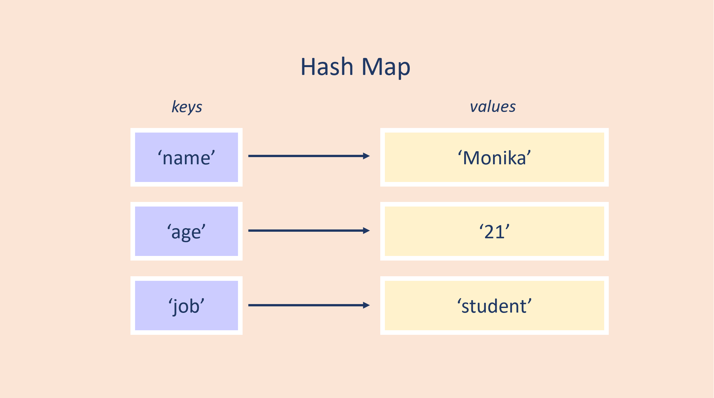
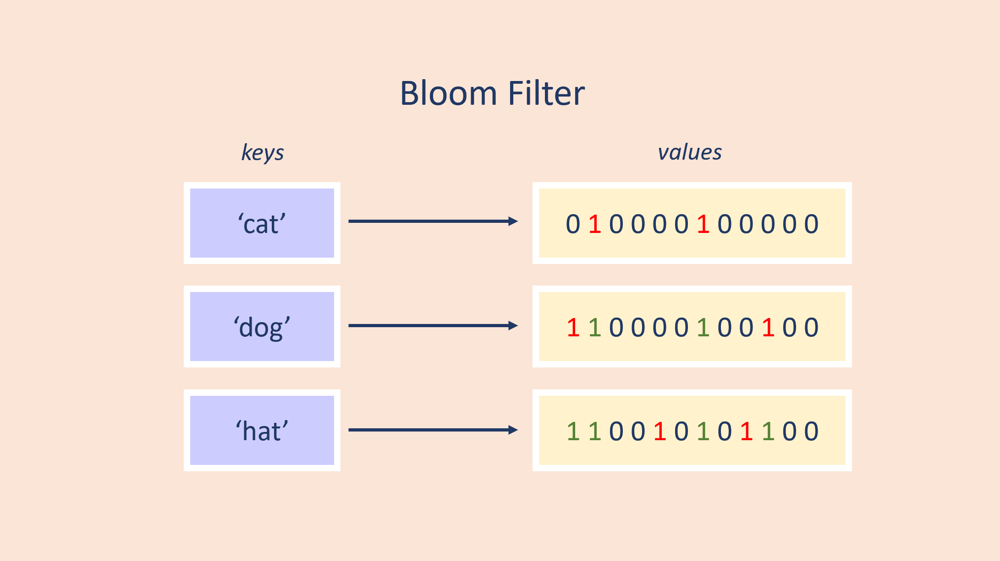

# An Efficiency Comparison between Hash Maps and Bloom Filters in C++

Monika Kanphade - October 14<sup>th</sup>, 2023

### What is a Hash Map?

Hash Maps are a data structure resembling a dictionary, storing elements in a key-value fashion. \
They use buckets to store values in unique keys determined by hash functions. \
The keys are unique indexes into the data structure that allow efficient retrival of a certain value from the lookup table.



### Implementation in C++:

```
#include <iostream> 
#include <unordered_map>  
#include <string>

int main() { 

    // Initialization of Unordered map (Hash map)
    std::unordered_map<std::string, std::string> hash_map; 

    // Inserting values by using [] operator 
    hash_map["name"] = "Monika"; 
    hash_map["age"] = "21"; 
    hash_map["job"] = "student"; 

    // Traversing an unordered map 
    for (auto pair : hash_map) 
        std::cout << pair.first << " " << pair.second << std::endl; 

}
```
    
### What is a Bloom filter?

Bloom filters are a probabalistic data structure that determine if a given key has been seen by the structure before. \
Oftentimes, they are used to determine data that has not been seen yet for particularly large datasets, however, \
the larger the dataset the more likely the bloom filter is to report a false positive (i.e. claiming that a key has been \
seen before when it hasn't).



### Implementation in C++:

From: https://github.com/ArashPartow/bloom/blob/master/bloom_filter.hpp

```
#include <iostream> 
#include <unordered_map>  
#include <string>

int main() {

    // Initialization of Bloom filter
    bloom_parameters parameters;
    parameters.projected_element_count = 10;    // number of elements to insert
    parameters.false_positive_probability = 0.0001;
    parameters.compute_optimal_parameters();
    bloom_filter bloom_filter(parameters);

    // Inserting values using .insert() function
    bloom_filter.insert("cat");
    bloom_filter.insert("dog");
    bloom_filter.insert("hat");

    // Check if Bloom filter has seen a unique key
    std::cout << bloom_filter.contains("cat") << std::endl; // True
    std::cout << bloom_filter.contains("bat") << std::endl; // False

}

```

## Behind the scenes

### Space Complexity:

#### Hash Map: 

Hash maps are oftentimes represented as an array containing <i>n</i> key-value pairs. The size of the array is dynamic, \
but the space complexity may also depend on the size <i>m</i> of the items it is storing. Different data types have \
different sizes.

 - Best case: O(n) - When items stored in the array are type <i>int, bool, etc.</i>
 - Worst case: O(n<sup>m</sup>) - When items stored in the array are type <i>string, objects, etc.</i>

#### Bloom Filter:

Bloom filters are also represented by an array, however, instead of containing the literal representation of the keys \
themselves, it contains a set number <i>m</i> of bits then can be set upon seeing a unique key. This makes them very \
space-efficient as the size is not dynamic.

- Best/Worst case: O(m) - The size of the bit array


### Time Complexity:

#### Hash Map:  

The time it takes for a Hash map to <b>INSERT, DELETE, and SEARCH</b> for data depends on a multitude of factors, \
such as the size of the buckets and whether they hold a singular item, and what the Hash function being used to map \
key-value pairs looks like. Collisions may increase the time complexity but can be prevented by a good hash function \
allowing uniform data distribution.

 - Best case: O(1) - When a key maps to a single value
 - Worst case: O(n) - When a key maps to multiple values


#### Bloom Filter:

The time it takes for a Bloom filter to <b>INSERT and SEARCH</b> for data depends on the number <i>k</i> hash functions \
implemented. Everytime a key is inserted into the bloom filter all hash functions must be applied for the key to \
attain its mapped bit values. When searching, the Bloom filter simply checks if all hash functions return a 1, \
indicating that bit was set.

- Best/Worst case: O(k) - The number of hash functions implemented


## Code Review

### Insertion Tests:

```
// Testing hash map insertion
for (int i = 0; i < 10000; i++) {
    hash_map[i] = i;
}

>>> Time Elapsed: 14007 microseconds

// Testing bloom filter insertion
for (int j = 0; j < 10000; j++) {
    bloom_filter.insert(j);
}

>>> Time Elapsed: 1926 microseconds
```
<span style="color:lime">Bloom filter wins!</span>

### Search Tests:

```
// Testing hash map search
for (int i = 0; i < 10000; i++) {
    hash_map.find(i);
}

>>> Time Elapsed: 1008 microseconds

// Testing bloom filter search
for (int j = 0; j < 10000; j++) {
    bloom_filter.contains(j);
}   

>>> Time Elapsed: 1996 microseconds
```

<span style="color:red">Hash map wins!</span>

### Space Complexity Tests:

```
// Insert 3 items into hash map
hash_map["name"] = "Monika"; 
hash_map["age"] = "21"; 
hash_map["job"] = "student"; 

std::cout << sizeof(hash_map) << std::endl;

>>> Size: 56 bytes

// Insert 3 items into bloom filter
bloom_filter.insert("cat");
bloom_filter.insert("dog");
bloom_filter.insert("hat");

std::cout << sizeof(bloom_filter.size()) << std::endl;

>>> Size: 8 bytes
```

<span style="color:lime">Bloom filter wins!</span>

## Summary

Overall, Bloom filters and Hash maps have their unique properties can allow the user an advantage in certain situations. \
Say you wanted to keep track of a large dataset for which you did not have enough memory to hold the individual instances \
of the data, a Bloom filter would be a perfect solution if the possibility of false positives wasn't an issue. However, \
if you needed to ensure accuracy about whether something is in the data and require some form of deletion, a Hash map \
would be the way to go as Bloom filters have trouble implementing a way to delete values.

