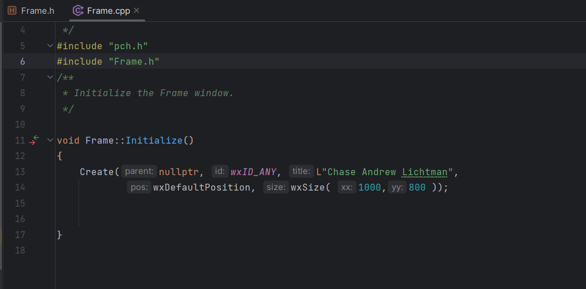

wxWidgets: A New Way To See C++

By: Chase Lichtman

C++ is a very expansive programming language that lets the user do many
different things.

However, the standard library does have its own limitations and is not
able to allow the user t sometimes to expand their horizons on their
programs. That is where libraries come in, to support C++ and make the
users experience more diverse. One of the most expansive libraries that
C++ has to offer is wxWidgets. wxWidgets allows a whole new world of
C++! Instead of having outputs only to the terminal, we are now able to
make screens and graphics and are now able to display high levels of
code! Downloading wxWidgets was a bit of a hassle. I downloaded it from
the website, https://wxwidgets.org/downloads/ and unzipped it. With that
on my computer.

To get it working and compiled I followed my professor's guide to how to
set it up on my IDE CLion while also using a CMAKE file. If you would
like to try and get this running, I would highly recommend watching

This will show you how to dudes the library. The author does his in
linux, but he shows and tells the listener the changes that would be
made if it was windows. I believe the hardest part of getting this
library working is adding it to the CMAKE file and getting it running,
but the video gives some assistance with this problem.

The functions in the wxWidgets library are very straightforward and are
easy to incorporate into your code. I will show a few functions and
their uses later in this post.

We need to first create our window that we want to show. I have created
a frame class and added an Initialize function to it. In it, we have
called the function Create. The parameters include- a parent (in this
case we have none), an Id, the title of the frame, a default
positioning, and how big to make the screen. This allows us to create a
window with our specific parameters.

We can call the window whatever we want and determine how big the window
will end up being.

{width="6.5in"
height="3.2111111111111112in"}

With a Frame class and an Initialize function made, we can now start
making a new frame to try and make a popup window. The show function is
apart of the wxWindows class from the library that lets us show the
window.

{width="6.5in"
height="3.6861100174978128in"}

With that being set, we can now run our program. wxWidgets makes it very
easy to run without needing a main function. In our main.cpp, we just
need to call wxIMPLEMENT_APP with our class name and that will run the
program.

{width="4.041666666666667in"
height="1.0416666666666667in"}

With that running we will get a popup window! We have officially ditched
the terminal and have a whole new world to display our code and make new
and exciting programs.

{width="6.5in"
height="5.026388888888889in"}

We are now able to use our imaginations and create whatever scene we
want. wxWidgets has plenty of classes allowing us to showcase and
display our creative minds. There are pens to draw out lines and
functions like wxColour that can change the color of those lines. We are
also able to change the background with the function
SetBackground(\*wx...) with whatever color we want replacing the
ellipses all in caps (EX. wxYELLOW).

In this example I have made a new view class. Here we can initialize
what we want to see on the screen and be able to paint and draw
pictures. The bind function will then call our paint function. We can
see that OnPaint has a parameter of a reference to a wxPaintEvent. We
can see it is not being used in the function. This paint event is used
for when a window's content needs to be changed or repainted. This may
be a bit confusing, but we can see what in Bind all we have to do is
&View::OnPaint. The paint event is just there to be like "Hey the window
needs to be painted over again." The wxAutoBufferedPaintDC is a huge
object. This will act as our canvas and make it so we can add things to
the screen. We then ask it to set the background to yellow.

{width="6.5in"
height="3.1777777777777776in"}

After declaring these functions, let's go back to our frame class and
initialize our new view. After creating the frame let's make a new view
object. We will then pass the frame that we just created into it and
initialize the view with the InitializeT function we made in the view
class. The "this" parameter for the InitializeT function just indicates
that we are working with a pointer to the frame that is in the function.

{width="5.933333333333334in"
height="2.183332239720035in"}

Once this is all done and we run again, we can now see that the entire
background is yellow!

{width="6.5in"
height="5.184722222222222in"}

The last thing I want to show you is to draw something onto our
background. With wxWidgets this is fairly simple. We just need to make a
pen and set that pen to a color. Then we just need to call the Drawline
function with the parameters of how long to make the line and where to
place the line

{width="3.466666666666667in"
height="0.5916655730533683in"}

Here is the results.

{width="3.3916666666666666in"
height="2.716666666666667in"}

That is just the surface of what this library can accomplish. We can
make full pictures with different shapes and all different colors plus
text.

All in all, this library is pretty simple to set up and can get
something popping up on our systems in a matter of minutes. The
functions are straight forward to use an add to your code and their
reference page is filled with detail and description of each function,
plus thousands of other uses of this library that I did not even get to.
I believe the hardest thing with this library is getting it set up and
configured properly on your system (but that goes for all libraries that
are not apart of

the standard library). This library is a must go to for someone wanting
to start getting into graphics and wants to elevate their C++
programming to a whole new level!
