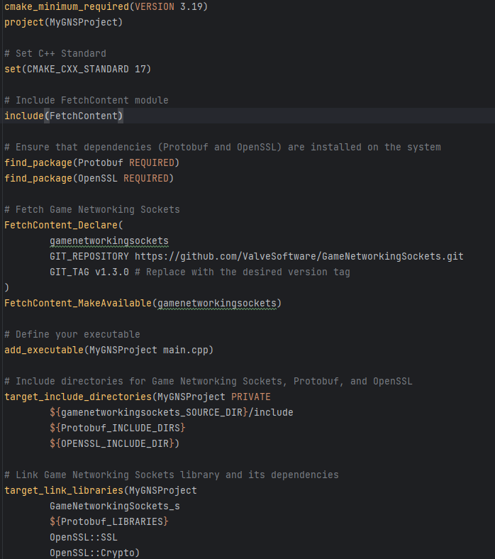
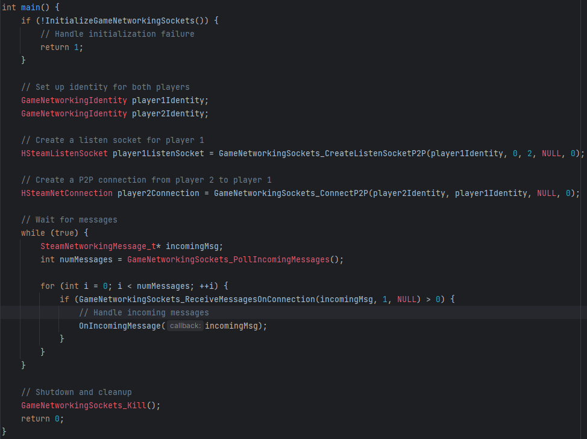
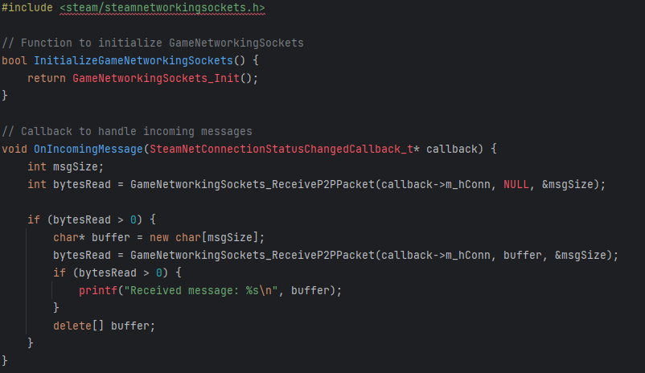
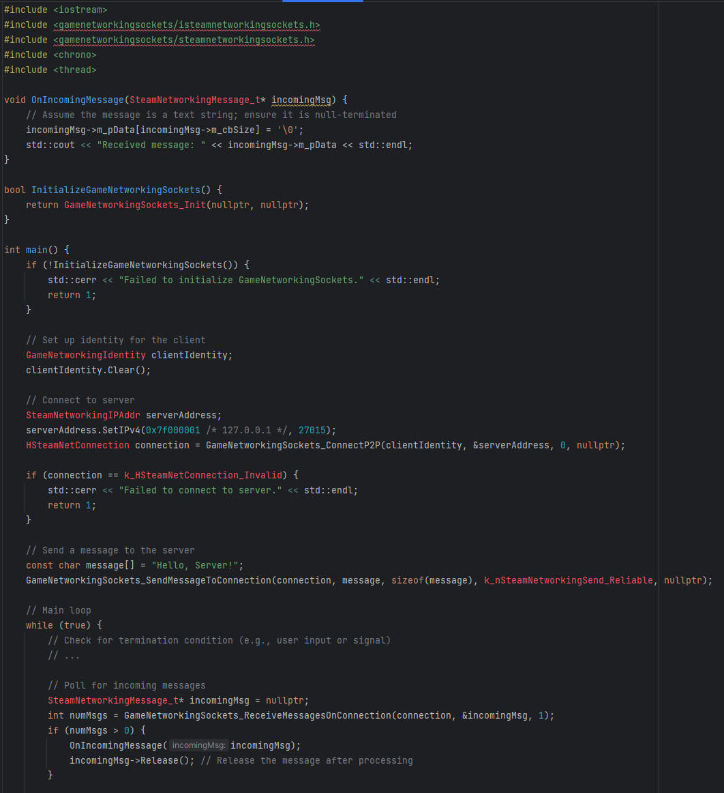
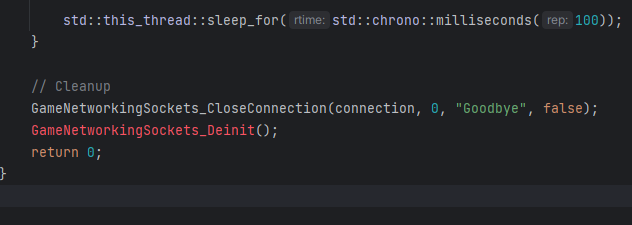
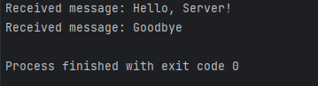
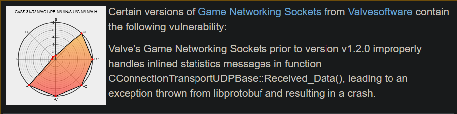
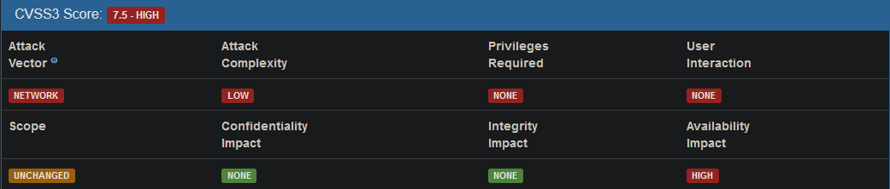

> GameNetworkingSockets: gamertime

Krish Magal

Any modern video game has some online aspect to it, whether it's online
multiplayer, in game shop, or cloud saves. Developers can spend a large
amount of time trying to find good libraries to use for their games, and
some are difficult to use without additional libraries, further\
complicating the process.

One library that makes a strong case to be used in the development of
video games is Valve Software's GameNetworkingSockets (GNS) library.

This library is one created by one of the largest names in video games,
Valve Software, best known for the creation of Steam and its following
products. This library is supposedly very well made and preferred by
many studios trying to publish games on Steam.

One of the main devs of this library stated that "The main interface
class is named SteamNetworkingSockets, and many files have \"steam\" in
their name. But *Steam is not needed*. If you don\'t make games or
aren\'t on Steam, feel free to use this code for whatever purpose you
want."

Without further ado, lets pull back the curtain and see what we can
find. When getting started, I found the easiest thing for me to do was
to set up a simple C++ project. One great thing about this library is
that there are multiple wrappers available, so that you can code in
either C# or Python, showing just how accessible this library is!

For this, I set up a simple CMake project. I found it was the easiest
way that I could get up and running, since I've got a decent amount of
experience with it. Of course, you can set up your configuration any way
you like, so mileage may vary. Below is an example of what your\
CMakeLists.txt might look like just to get started, we could be updating

this.

{width="6.5in"
height="7.337498906386702in"}

As you can see, it's very simple to be able to fetch the library from
GitHub, but the other 2 libraries required are locally installed! I've
linked install guides for both Protobuf and OpenSSL down at the bottom
If you're interested in checking out the GitHub repo, I've linked it For
this

project, I've set up a simple P2P messaging system. P2P games are great
for LAN parties, and games that don't need a true internet connection.

Here's a simple main function that creates 2 players and binds them to 2
sockets. Once the sockets have been bound, the client begins polling for
incoming messages.

{width="5.665277777777778in"
height="4.234721128608924in"}

Here you can see a simple main function that shows the instantiation of
players 1 and 2. Since we are establishing a P2P connection, both of
those connections are established right after. Next, we have a while
true loop. This is to poll for incoming messages from both players,
where the handler for incoming messages is called.

Here's what we might do when we get a message:

{width="6.2in"
height="3.5861111111111112in"}

This function here describes the behavior we might execute when the
manager receives a message from its peers. This allows us to measure the
length of the message and then, if the message is not empty, display the
received message.

{width="6.5in"
height="7.111111111111111in"}

{width="6.5in"
height="2.313888888888889in"}

Here, you can see the above implementation of what a client might look
like. We set up the client identity using our network information and
connect to our remote host.Make Sure to set
SteamNetworkingIPAddr::IPv4Localhost(0) with the appropriate remote
address. This sends a message, "Hello, Server!" when it connects, and
has an infinite loop to poll for pings.

Here is our output from the server.

{width="3.738888888888889in"
height="1.0208333333333333in"}

These are very basic examples, however, and a true client should include
error handling, connection management (such as reconnection logic),
proper message encoding/decoding, and potentially asynchronous\
processing or event-driven architecture. You would also need to properly
handle user input or game events to trigger sending messages and
reacting to incoming messages accordingly.

Unfortunately, there are large issues with GNS that make it rather\
cumbersome and difficult to use. GNS requires the use of another
library, Protocol Buffer a.k.a. Protobuf for serialization as well as
OpenSSL. GNS has Protobuf and OpenSSL hard coded into its code, so
unfortunately you

can't use your own preferred libraries. These are large amounts of

information so I've linked a few installation guides.

Here's the most recent CVE report on the vulnerability score of the GNS
library for anyone considering using this library in a personal game or
other project.

{width="6.5in"
height="1.6291666666666667in"}

It currently features a score of 7.5, a high vulnerability score. Let's
break it down.

{width="6.5in"
height="1.386111111111111in"}

As you can see here, this flaw features a low attack complexity and a
high availability impact. Developers can rest easy however, as it has
neither any confidentiality impact nor any integrity impact.
Unfortunately, it's not made clear if this is the proprietary version,
or rather the open-source version. I would hope that some brave network
engineer found a way to fix this.

In conclusion, after going through the setup and development process, I
would not recommend using this library for beginners. It's difficult to
set up, with it requiring 2 additional libraries, which were a pain to
install and link. An easier to use alternative would be SFML, which has
multiple modules, including graphics and a simple, yet powerful
networking module. I hope you found this piece informative!
