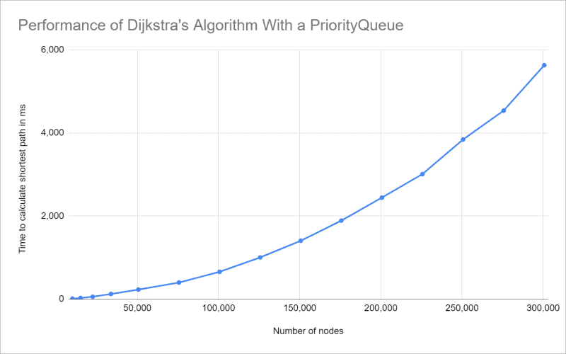
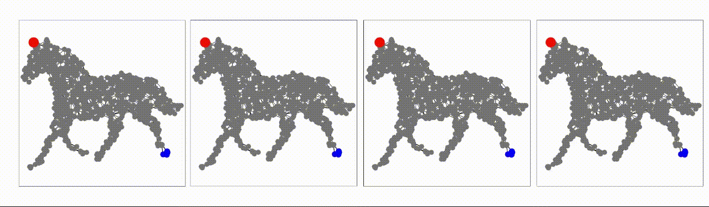

# Comparative Analysis of Djikstra’s and A* Algorithms 

**Yousif Murrani**

## Introduction

Have you ever wondered how your GPS knows the exact quickest directions to get you to your destination or how 
a video game enemy will always move exactly towards you no matter what’s in their way? It’s all thanks to pathfinding 
algorithms. Pathfinding algorithms are crucial in today's world, whether it’s to get you to work on time or to optimize 
your code. In this article, we’ll dive into the two biggest powerhouses of the pathfinding world: Dijkstra’s 
and the A* Algorithms.

We will start off with Dijkstra’s algorithm and explore its core concepts as well as its limitations. Then, we will 
look at the more modern approach of the A* algorithm and see where it might be the better approach.

In this blog, we will take an in-depth look at Dijkstra’s algorithm, providing pseudocode and some examples 
then we will do the same for A*. In the examples, we’ll test out both algorithms in scenarios of different difficulty 
for the algorithms to figure out and see how long it takes each one to complete the task. Afterwards, we’ll compare 
the two in terms of efficiency so that you know which to use in each scenario.

## Dijkstra’s Algorithm

### Overview

One of the most popular pathfinding algorithms in the world is Dijkstra’s algorithm, published by Edsger W. Dijkstra 
in 1959. The algorithm was designed to find the shortest path between a given node and every other node in a 
positive-weighted graph, essentially making it a Greedy Algorithm. It can also be classified as a Search Algorithm. 
The algorithm can also be changed to find the shortest path between any given starting node and a destination node 
then stopping. The data structures used within the code are usually a priority queue or a heap to optimize it.

Here is a Gif showing how Dijkstra's Algorithm Works in Real Time:


### Pseudocode

```cpp
void Dijkstra(int graph[6][6], int src) // adjacency matrix used is 6x6
{
    int dist[6]; // integer array to calculate minimum distance for each node.
    bool Tset[6]; // boolean array to mark visited/unvisited for each node.
    
    // Set the nodes with infinity distance except for the initial node and mark them unvisited.
    for (int i = 0; i < 6; i++)
    {
        dist[i] = INT_MAX;
        Tset[i] = false;
    }
    
    dist[src] = 0; // Source vertex distance is set to zero.
    
    for (int i = 0; i < 6; i++)
    {
        int m = minimumDist(dist, Tset); // vertex not yet included.
        Tset[m] = true; // m with minimum distance included in Tset.
        
        for (int i = 0; i < 6; i++)
        {
            // Updating the minimum distance for the particular node.
            if (!Tset[i] && graph[m][i] && dist[m] != INT_MAX && dist[m] + graph[m][i] < dist[i])
                dist[i] = dist[m] + graph[m][i];
        }
    }
    
    cout << "Vertex\t\tDistance from source" << endl;
    
    for (int i = 0; i < 6; i++)
    {
        char str = 65 + i; // Ascii values for printing A, B, C, ...
        cout << str << "\t\t\t" << dist[i] << endl;
    }
}
```

### Examples

### Time/Space Complexity

Here are the Time and Space complexities for Dijkstra's Algorithm:

Time Complexity: O((|V| + |E|) * log(V))

Space Complexity: O((|V| + |E|)) 

In the formulas, 'V' represents the number of Vertices (nodes) in the graph while 'E' represents the number of 
Edges (connections between nodes) in the weighted graph. Using these two numbers, we can calculate the Big-O notation
of Dijkstra's Algorithm.

This is best shown in this graph:



While it starts out very similar to an O(n) algorithm, we can see that it starts to curve upwards more rapidly near
the end. This leads us to believe that it's time complexity will be somewhere between O(nlog(n)) and O(n^2),
as shown below:


### Applications

## A* Algorithm

### Overview

The A* (referred to as 'A-Star') Algorithm, like its predecessor Dijkstra's, is a very powerful pathfinding algorithm 
designed to find the shortest path between a starting node and a destination node. However, unlike Dijkstra's, 
the A* is only a Search Algorithm. Another feature that sets A* apart is its ability to use a heuristic, which is a 
function that can help it find the solution more quickly, albeit giving up some level of accuracy and precision. This 
algorithm was actually created as a part of the [Shakey Project](https://en.wikipedia.org/wiki/Shakey_the_robot), 
which was building a robot that could choose its own actions. However, it has since become popular in many different 
pathfinding uses.

Here is a quick showcase of the A* Algorithm working with four different heuristics:



In the Gif, from left to right, the A* method is increasingly using a heuristic that prefers points that are closer 
to the goal. When not using a heuristic, the algorithm becomes extremely similar to Dijkstra's.

## Pseudocode

```cpp
// A* (star) Pathfinding// Initialize both open and closed list 
let the openList equal empty list of nodes 
let the closedList equal empty list of nodes// Add the start node 
put the startNode on the openList (leave it's f at zero)// Loop until you find the end 
while the openList is not empty    // Get the current node 
    let the currentNode equal the node with the least f value 
    remove the currentNode from the openList 
    add the currentNode to the closedList    // Found the goal 
    if currentNode is the goal 
        Congratz! You've found the end! Backtrack to get path    // Generate children 
    let the children of the currentNode equal the adjacent nodes 
     
   for each child in the children        // Child is on the closedList 
        if child is in the closedList 
            continue to beginning of for loop        // Create the f, g, and h values 
        child.g = currentNode.g + distance between child and current 
        child.h = distance from child to end 
        child.f = child.g + child.h        // Child is already in openList 
        if child.position is in the openList's nodes positions 
            if the child.g is higher than the openList node's g 
                continue to beginning of for loop        // Add the child to the openList 
        add the child to the openList 
```

### Examples

### Time/Space Complexity

The Time and space complexity of the A* Algorithm is dependent on the heuristic used  for the algorithm. At best, it 
could be O(1), at worst it would have the time and space complexity of Dijkstra’s Algorithm.

### Applications

## Comparing the Two Algorithms

### Key Features

### When To Use

### Differences and Similarities

## Efficiency Analysis

### Overall Efficiency of Each

### Why is Efficiency Important

## Visual Comparison

Here is a quick video showing the two different algorithms' pathfinding:

https://www.youtube.com/watch?v=19h1g22hby8

## Conclusion

### Summary of Findings

### Recommended Uses

### Possible Future Developments

## References

https://en.wikipedia.org/wiki/Dijkstra%27s_algorithm

https://favtutor.com/blogs/dijkstras-algorithm-cpp

https://www.educative.io/answers/how-to-implement-dijkstras-algorithm-in-cpp

https://www.happycoders.eu/algorithms/dijkstras-algorithm-java/

https://en.wikipedia.org/wiki/A*_search_algorithm

https://www.educative.io/answers/what-is-the-a-star-algorithm

https://www.freecodecamp.org/news/big-o-cheat-sheet-time-complexity-chart/

https://www.geeksforgeeks.org/a-search-algorithm/

https://medium.com/@nicholas.w.swift/easy-a-star-pathfinding-7e6689c7f7b2 