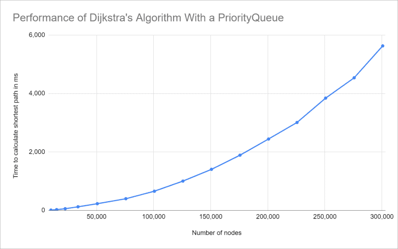
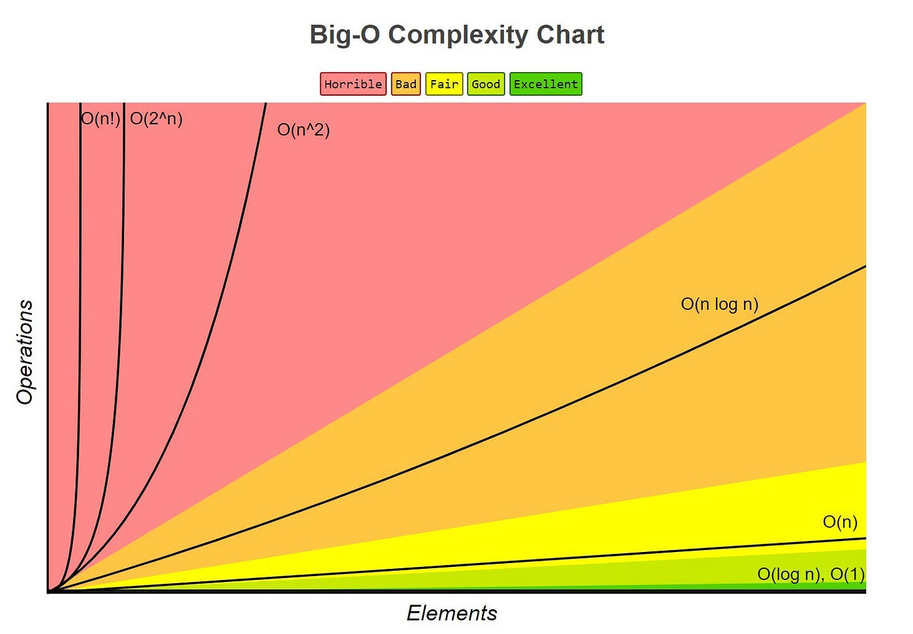

# Comparative Analysis of Djikstra’s and A* Algorithms 

**Yousif Murrani**

## Introduction

Have you ever wondered how your GPS knows the exact quickest directions to get you to your destination or how 
a video game enemy will always move exactly towards you no matter what’s in their way? It’s all thanks to pathfinding 
algorithms. Pathfinding algorithms are crucial in today's world, whether it’s to get you to work on time or to optimize 
your code. In this article, we’ll dive into the two biggest powerhouses of the pathfinding world: Dijkstra’s 
and the A* Algorithms.

We will start off with Dijkstra’s algorithm and explore its core concepts as well as its limitations. Then, we will 
look at the more modern approach of the A* algorithm and see where it might be the better approach.

In this blog, we will take an in-depth look at Dijkstra’s algorithm, providing pseudocode and some examples 
then we will do the same for A*. In the examples, we’ll test out both algorithms in scenarios of different difficulty 
for the algorithms to figure out and see how long it takes each one to complete the task. Afterward, we’ll compare 
the two in terms of efficiency so that you know which to use in each scenario.

## Dijkstra’s Algorithm

### Overview

One of the most popular pathfinding algorithms in the world is Dijkstra’s algorithm, published by Edsger W. Dijkstra 
in 1959 [1]. The algorithm was designed to find the shortest path between a given node and every other node in a 
positive-weighted graph, essentially making it a Greedy Algorithm (an algorithm designed to make the best possible choice at every step
without considering the future result). It can also be classified as a Search Algorithm. 
The algorithm can also be changed to find the shortest path between any given starting node and a destination node 
then stopping. The data structures used within the code are usually a priority queue or a heap to optimize it.

Here is a Gif showing how Dijkstra's Algorithm Works in Real Time:


[1]

### Pseudocode

```cpp
function dijkstra(G, S)
    /// Initialize distance and previous arrays
    for each vertex V in G
        distance[V] <- infinite  // Set initial distance to infinity
        previous[V] <- NULL      // Set previous vertex to NULL
        If V != S, add V to Priority Queue Q  // Add all vertices to the priority queue except the source

    distance[S] <- 0  // Set distance from source to itself to 0, as it's the starting point
	
    /// Main loop to find the shortest paths
    while Q IS NOT EMPTY
        U <- Extract MIN from Q  // Extract vertex with minimum distance from the priority queue
        for each unvisited neighbour V of U
            tempDistance <- distance[U] + edge_weight(U, V)  // Calculate the tentative distance
            if tempDistance < distance[V]
                distance[V] <- tempDistance  // Update the distance
                previous[V] <- U  // Update the previous vertex for the current vertex V
    
    /// Return the final distance and previous arrays
    return distance[], previous[]
```
[10]

### Time/Space Complexity

Time and Space Complexity are two very important concepts in the realm of Computer Science. Time Complexity
refers to the amount of time an algorithm takes to run based on the amount of inputs (n). Space Complexity is
similar, but refers to the amount of memory (space) allocated to run the code.

Here are the Time and Space complexities for Dijkstra's Algorithm:

Time Complexity: O((|V| + |E|) * log(V))

Space Complexity: O((|V| + |E|)) 
[3]

In the formulas, 'V' represents the number of Vertices (nodes) in the graph while 'E' represents the number of 
Edges (connections between nodes) in the weighted graph. Using these two numbers, we can calculate the Big-O notation
of Dijkstra's Algorithm.

This is best shown in this graph:


[4]

While it starts out very similar to an O(n) algorithm, we can see that it starts to curve upwards more rapidly near
the end. This leads us to believe that its time complexity will be somewhere between O(nlog(n)) and O(n^2),
as shown below:


[6]

### Applications

* Route Planning: Dijkstra's is used extensively in route planning and navigation systems, helping find the shortest
path between locations and defining an accessible route between them.
* Network Packet Routing: One of the biggest use cases for the algorithm is helping find the shortest path between
nodes so that routers can quickly send packets from a source to a destination.
* Pathfinding in Video Games: As mentioned earlier, many game developers also incorporate Dijkstra's in video games,
allowing the game characters to navigate the maps they are a part of with efficiency.
[2],[8]

## A* Algorithm

### Overview

The A* (referred to as 'A-Star') Algorithm, like its predecessor Dijkstra's, is a very powerful pathfinding algorithm 
designed to find the shortest path between a starting node and a destination node. However, unlike Dijkstra's, 
the A* is only a Search Algorithm and not a Greedy Algorithm. This is because A* takes into consideration the overall result,
and not just the best option at the current step. Another feature that sets A* apart is its ability to use a heuristic, which is a 
function that can help it find the solution more quickly, albeit giving up some level of accuracy and precision [6]. This 
algorithm was actually created as a part of the [Shakey Project](https://en.wikipedia.org/wiki/Shakey_the_robot), 
which was building a robot that could choose its own actions. However, it has since become popular in many different 
pathfinding uses [5].

Here is a quick showcase of the A* Algorithm working with four different heuristics:


[5]

In the Gif, from left to right, the A* method is increasingly using a heuristic that prefers points that are closer 
to the goal. When not using a heuristic, the algorithm becomes extremely similar to Dijkstra's.

## Pseudocode

```cpp
make an openlist containing only the starting node
make an empty closed list
while (the destination node has not been reached):
   consider the node with the lowest f score in the open list
   if (this node is our destination node) :
       we are finished 
   if not:
       put the current node in the closed list and look at all of its neighbors
       for (each neighbor of the current node):
           if (neighbor has lower g value than current and is in the closed list) :
               replace the neighbor with the new, lower, g value 
               current node is now the neighbors parent            
           else if (current g value is lower and this neighbor is in the open list ) :
               replace the neighbor with the new, lower, g value 
               change the neighbors parent to our current node

           else if this neighbor is not in both lists:
               add it to the open list and set its g
```
[11]

### Time/Space Complexity

The Time and space complexity of the A* Algorithm is dependent on the heuristic used  for the algorithm. At best, it 
could be O(1), at worst it would have the time and space complexity of Dijkstra’s Algorithm. That means that depending
on the heuristic implemented in the algorithm, the code will either run in constant time ( O(1) ), or it can take as
long as Dijkstra's algorithm, O((|V| + |E|) * log(V)) [5].

### Applications

* Robotics: A* is used commonly in the Robotics field, helping robots navigate by finding optimal paths around obstacles.
This is actually the first real-world application of A* as it was created for the Shakey Project to help a robot
navigate a room.
* Machine Learning: The algorithm is also used in Artificial Intelligence models to optimize decision-making in the
system, leading to a faster and more efficient AI.
* Pathfinding in Video Games: Similar to Dijkstra's, A* is also great for providing a pathfinding method in many video 
games. Due to its ability to use heuristic, it also provides developers with the ability to have different levels of
accuracy for the path the characters take.
[9]

This video shows how A* works in a 2D grid by always trying to move towards its goal location:

https://www.youtube.com/watch?v=19h1g22hby8

## Comparing the Two Algorithms

### Key Features

While A* and Dijkstra's are both very efficient pathfinding algorithms, they differ in their methods. Some key features
of the A* Algorithm are:

* Informed Search: As mentioned earlier, A* performs an informed search when finding the shortest path. This means that
it keeps track of the cost from the current vertex to the goal vertex and bases its search off that.
* Heuristic: Using a good heuristic, A* can narrow its choices down so that it takes the fewest steps possible while
still maintaining the correct path.
* G(n) and H(n) Values: To evaluate which node it should move to, A* sums the cost of the distance between the start
node and the current node ( G(n) ) to the cost of the distance between the current node and goal node ( H(n) ).

These features allow A* to compete with Dijkstra's, who's key features include:

* Uninformed Search: Dijkstra's does not take into account the location of the goal node. This allows it to make the
best decision at every step without worrying about the overall result and assuming that these desicions will lead to the
optimal solution.
* Optimal Paths: Assuming that all the edges between the nodes are non-negative, Dijkstra's will find the shortesy path 
between the start node to every other node on the map.
* Total Exploration: Dijkstra's algorithm explores every vertex on the graph and finds the shortest path to all of them,
including the goal vertex.

### When To Use

Knowing when to use Dijkstra's Algorithm or the A* Algorithm is very important as it can change the speed of your code
significantly. 

Dijkstra's is the usually better choice when the graph is sparse, meaning that there are fewer vertices than edges, as
it tends to perform better with fewer nodes. Another reason to use Dijkstra's is if you need to find the shortest
path to all the other nodes in the graph and not just the goal node. Lastly, if a good heuristic is not available,
it is safer to use Dijkstra's than to use A* with a bad heuristic.

However, if you do have a good heuristic function on hand, A* is most definitely the go-to method. With a good
heuristic, A* can be much faster as it only focuses on reaching the goal node and not finding paths to every other node.
This also leads A* to work better in dense graphs with many nodes, as it gives the algorithm more options to reach
the destination. Due to A* exploring fewer nodes overall than Dijkstra's, A* uses less memory to reach the destination.
This is very important if you have a constraint on the Space Complexity of your program.

### Differences and Similarities

Dijkstra's and A* Algorithms are very similar to each other, which is why they are always debated on in terms of
effectiveness and efficiency. There main similarities include:

* Main Objective: Both algorithms are used for pathfinding in graphs, mainly for finding the shortest path between a
start node and a goal node.
* Weighted Graphs: The two algorithms are used on weighted graphs where each edge between two vertices has a specific
numerical weight.
* Node Tracking: Both keep track of nodes that they have already visited to ensure that they don't accidentally re-visit
the same node more than once.
* Priority Queue: A priority queue data structure is most commonly used in both algorithms to select a node for the
next step.

While they are very similar, the two also have some major differences, the biggest ones being:

* Heuristic: The A* Algorithm's use of a heuristic function is one of the biggest differences. Dijkstra's does not rely
on one when performing its search.
* Time/Space Complexity: Dijkstra's commonly has a greater time and space complexity than A* because of its need to search
all the nodes in the graph. This is very obvious when dealing with a denser graph.
* Overall Completeness: Dijkstra's Algorithm will search through the entire graph and explore each of the nodes, while
A* takes a more efficient approach and focuses only on the nodes that will help it reach its goal faster.

## Efficiency Analysis

### Why is Efficiency Important

Efficiency is one of, if not the most, important aspects of good code. Since some of these algorithms are used
in essential and valuable operations, making sure the algorithm is capable of handling large amounts of data at a 
proficient speed is of the utmost importance.

### Overall Efficiency of Each

Dijkstra's algorithm is most efficient when you have a small amount of nodes and a large amount of edges between 
those nodes. This type of graph, a sparse graph, allows Dijkstra's to work at its full potential. Dijkstra's is also
the most efficient pathfinding algorithm if you don't know the location of your goal node. This is because Dijkstra's
algorithm searches through all of its surrounding nodes until it finds the correct one. However, this does lead it
to have a larger Time and Space Complexity.

A*, on the other hand, works best when there is a large amount of nodes in the graph. This denser graph, put together
wil a good heuristic function, allows A* to find the goal node extremely fast. However, A* is very reliant on its
heuristic function, meaning that if the heuristic is non-admissible, the algorithm will be ineffective and have a 
hard time finding the goal.

## Visual Comparison

Here is a quick video showing the two different algorithms' pathfinding in real time:

https://www.youtube.com/watch?app=desktop&v=g024lzsknDo

As shown in the video, A* tends to work much quicker than Dijkstra's when trying to find the goal node. This is due
to Dijkstra's method of searching all the nodes around its current node before moving forward. However, this is
not always the case. As shown at 1:30 in the video, Dijkstra's will actually work faster than A* in some situations.

## Conclusion

In the dynamic world of pathfinding algorithms, Dijkstra's Algorithm and the A* Algorithm emerge as the top two contenders,
leaving all others in the dust. Both with unique strengths and applications, it is evident that their differences play
vital roles in terms of what situation they would be most useful in.

### Summary of Findings

Dijkstra's Algorithm, a pathfinding powerhouse since its creation in 1959, shows why it has stayed relevant in the ever-changing 
world of computer science because of its efficiency when it comes to positively weighted graphs. By performing an uninformed 
search, it is able to make the best decision at every step of the process and is guaranteed to find the shortest path
if it exists.

Its modern competitor, the A* Algorithm, shows off that an informed search, or knowing where the end goal is, can be
just as good, if not better, than an uninformed search. A* also introduces the concept of using a heuristic function to
help lessen the burden of pathfinding. Equipped with a good heuristic, A* does not need to search all nodes in a graph
like Dijkstra's, but instead moves directly to the goal in a very efficient manner.

### Recommended Uses

While both have proven to be very useful algorithms, each has cases where it will clearly shine. In scenarios where the
edges represent costs or distances, Dijkstra's is the more optimal option as exploring all the nodes in the graph is
necessary. This algorithm will work even better if the graph is sparse. However, if the scenario calls for efficiency 
or there is a time constraint, the more modern A* should be the go-to algorithm. With a powerful heuristic, A* can
reduce its time and space complexity to near-constant. This will also work especially well if the graph is very dense.

### Possible Future Developments

As technology continues to grow and evolve, the field of pathfinding algorithms will also grow alongside it. In the 
future, a more evolved heuristic may be created that will allow A* to work in all sorts of graphs, dense or sparse. 
Advancements in parallel processing may also help advance Dijkstra's Algorithm, allowing it to handle large sets of 
data in a more efficient manner. Another possibility is that in the coming years, we will see a new pathfinding
algorithm rise, one that will incorporate all the advantages of A* and Dijkstra's without any of the disadvantages.

In conclusion, the choice between using Dijkstra's Algorithm or the A* Algorithm depends entirely on the situation that the
algorithm is being incorporated into. There is no one-size-fits-all solution, but these two algorithms can be used most 
effectively if they are integrated into the correct scenario. Despite both being around for many years, they are still
invaluable tools that every programmer should know how to use to optimize pathfinding, whether it's for networks, 
creating video games, or just for fun.

## References

[1] “Dijkstra’s Algorithm.” Wikipedia, Wikimedia Foundation, 6 Nov. 2023,
    https://en.wikipedia.org/wiki/Dijkstra%27s_algorithm.

[2] Bhadaniya, Shivali. “Dijkstra’s Algorithm in C++: Shortest Path Algorithm.” FavTutor, 20 May 2021,
    https://favtutor.com/blogs/dijkstras-algorithm-cpp.

[3] “Educative Answers - Trusted Answers to Developer Questions.” Educative,
    www.educative.io/answers/how-to-implement-dijkstras-algorithm-in-cpp. Accessed 19 Nov. 2023.

[4] Woltmann, Sven. “Dijkstra’s Algorithm (with Java Examples).” HappyCoders.Eu, HappyCoders.eu, 25 Nov. 2020,
    www.happycoders.eu/algorithms/dijkstras-algorithm-java/.

[5] “A* Search Algorithm.” Wikipedia, Wikimedia Foundation, 13 Oct. 2023,
    https://en.wikipedia.org/wiki/A*_search_algorithm.

[6] Olawanle, Joel. “Big O Cheat Sheet – Time Complexity Chart.” freeCodeCamp.Org, freeCodeCamp.org, 25 Oct. 2022,
    www.freecodecamp.org/news/big-o-cheat-sheet-time-complexity-chart/.

[7] “A* Search Algorithm.” GeeksforGeeks, GeeksforGeeks, 8 Mar. 2023,
    www.geeksforgeeks.org/a-search-algorithm/.

[8] Bhattacharyya, Soumalya. “How Is Dijkstra’s Algorithm Used in the Real World?” Analytics Steps, 11 Sept. 2023,
    www.analyticssteps.com/blogs/how-dijkstras-algorithm-used-real-world.

[9] S, Ravikiran A. “A* Algorithm Concepts and Implementation.” Simplilearn.Com, Simplilearn, 17 Oct. 2023,
    www.simplilearn.com/tutorials/artificial-intelligence-tutorial/a-star-algorithm.

[10] “Dijkstra’s Algorithm.” Programiz, 
    www.programiz.com/dsa/dijkstra-algorithm. Accessed 19 Nov. 2023.

[11] "A* Search" Brilliant.org. Retrieved 19:35, November 19, 2023,
    from https://brilliant.org/wiki/a-star-search/