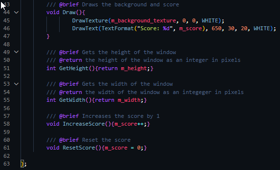
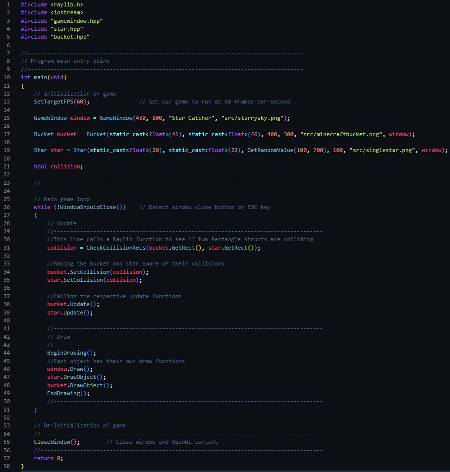

**Raylib: A Powerful Building Block For Old and New**

*Zane O'Dell*

Whether you use powerful tools such as Unreal Engine or are writing your
game in VIM, C++ is a powerful language that has the capability to
create any number of games, using almost any number of software tools.

One such tool that can be used is a library written in native C called
Raylib. Raylib is a library used for creating games, and has various
functions for different aspects of game development. One thing Raylib
prides itself on is its lack of a GUI or external tools/editors. Raylib,
as they claim on their official website (
[[Raylib]](https://www.raylib.com/index.html) ), does not
provide a large set of API documentation or a plethora of tutorials for
programmers to utilize, and encourages its users to dive right into
making things with its API and getting comfortable using its library
cheat sheet to gain knowledge of its inner workings.

With all of that being said, let's dive right into using Raylib to
create a simple game using its tools. The kind of game that will be made
is a simple catch game, in which the player will move left and right
across the screen catching an item that falls from the top of the screen
while avoiding other obstacles that fall from the top of the screen.

In getting started with Raylib, I followed the install instructions on
the website, and using Visual Studio Code as my IDE of preference, we
can start creating our simple game.

In order to use Raylib with C++, there are some additional steps to set
it up in VSCode. It was a bit difficult to get it set up with my IDE.
However, I did find a tutorial to be helpful that is linked here:
[[Raylib VSCode
tutorial]](https://www.youtube.com/watch?v=PaAcVk5jUd8&list=PLwR6ZGPvjVOSRywn9VCQ3yrRVruxzzuo9&index=6).

While it is possible to write any game using Raylib fully in C, using
C++ allows for more flexibility and levels of abstraction. So, in
writing our catch game, we'll be making use of classes and inheritance
features that are missing in C.

Let's start with the main function.

As the function call suggests, SetTargetFPS sets the frames per second
that our game will run at, which in our case is 60.

Next, we should create our window that the game will be played in.
Rather than just using Raylib's functionality in the main function we
can create our own C++ classes that utilize Raylib and abstract them.

The first class we can make is a GameWindow, in gamewindow.hpp\
\

Again, we can start from the top and work our way down.

Within the class we have various member variables, all denoted in their
naming scheme with a "m\_" prefix. We have the height of the window, the
width, and the title of the window as a string literal, represented as a
const char \*, which will show up on the top of the window once the
program is run.

Next, we have more interesting variables. Firstly, we have a string
literal that is a file path to the texture we wish to use for the
background, and then an actual Texture2D instance that will hold our
texture pointed at by the filepath. Finally, we have a score for our
game as an integer, representing how many times the player has caught
our star in succession.

All member variables of the GameWindow other than the score will be
passed in through the class constructor, initializing the object ready
for use as shown on line 15 of the main function.

With our window created, we can move into creating the main objects of
our game, being the star that we catch, and the bucket that we catch it
in. As they both are objects within our game, we can create a base class
for both of these objects, being a GameObject class.

This class will act as the basis for both of our main pieces of the
game, being the star and bucket as mentioned previously. Each of these
objects will have shared class member variables, such as a width,
height, x position, y position, a file path to a texture and a texture
itself, a reference to the window that it is a part of, being our
GameWindow instance, a rectangle, indicating its physical space in the
game used to detect collisions, and a boolean stating whether or not the
object's rectangle is colliding with another object's rectangle.

In regards to the object's creation via its constructor, each object
will take in those member variables, other than a Texture2D and a
rectangle, as those will be either loaded/created within the constructor
itself, as shown above. Specifically, the m_rect member variable is a
struct that contains four parameters, being the x and y positions, and
then the width and height of the rectangle. The LoadTexture function
will take in a file path, and return a Texture2D object that is the
texture pointed at by the file path.

Afterwards, we can call DrawObject, which calls a Raylib C function that
draws the texture at a x position and y position. Afterwards, we have
various getters and setters for member variables of the class, followed
by a pure virtual function, denoted by the "0" after the function
declaration. The behavior within the Update function, which is called
every frame, will be special for each object so we can make it a pure
virtual function.

With our base object class created, now we can make the classes for our
actual objects, starting with Bucket.

Other than the constructor, which is derived from the base class, we
only need to implement our Update function specifically for the bucket.
Essentially, we use Raylib functions to detect input from the keyboard,
and depending on the key (left or right arrow key), we move the position
of the object and its rectangle/collider to the left or right.

Next, we can move on to the Star class.

Just like Bucket, we are able to use an initializer list for the
constructor and override the Update function. In this function, we have
the star fall at a certain rate every frame. After that, we just check
if the star is past the bottom of the screen, or if it is colliding with
the bucket. If so, we reset the star's position, towards the top of the
screen at a random x value within a certain range. If the star was reset
by colliding, we call the increase score function from the window
reference. If not, we reset the score entirely.

Here within the main function is the rest of the game loop. We begin by
seeing if the star and bucket are colliding and tell both objects if
they are colliding. Then, we call their respective update functions and
draw the objects. In Raylib, we have to have any drawing done in between
the BeginDrawing and EndDrawing functions.

Our final result is this:

We have our bucket moving left and right when detecting left and right
arrow keys as input, the bucket and star colliding and adding/resetting
the score, and the star moving down and resetting upon a collision or it
reaching the bottom of the screen. While a simple game, it makes use of
some of the more used functions that Raylib as a library provides.

Overall, Raylib is extremely easy to use and learn. While the official
website does not directly have a lot of tutorials to boast, there are
plenty of external resources outside of the documentation that
programmers can utilize in their game creation journey.

Below are multiple GitHub repositories of games that utilize Raylib in
their development, including the simple game created for the purpose of
this tutorial.

Overall, I would give Raylib a more than satisfactory rating and would
recommend it to any and all C/C++ programmers looking to make their own
video games or game-like simulatory programs.

Additional Resources:

[[Games created with
Raylib]](https://github.com/raysan5/raylib-games)

[[Tutorial Catch
Game]](https://github.com/ZaneMODell/raylibtutorial)
