# OpenCV C++ Tutorial

*OpenCV* is a powerful computer vision (CV) library for various languages including Python, Java, and C++. In this blog post I will detail how to use some simple functions to read images, capture live video, and process images and videos in C++ with the help of OpenCV. I will assume that you have already downloaded and installed OpenCV as well as a C++ compiler and some sort of editor. I am using MinGW on Windows with VSCode, and I will be using a Makefile to help compile my code.

## The Mat Class

The *Mat* (matrix) class is the most fundamental part of the OpenCV library. It represents an n-dimensional array (commonly two or three dimensions) and is often used to store data relating to images. For color images, OpenCV uses the *BGR* color format (blue, green, and red) to represent the intensity of each color in a pixel. The scale on which intensity is measured is called *depth*, which can be represented by various data types (8-bit and 16-bit signed and unsigned integers, 32-bit signed integers, and 32-bit and 64-bit floating-point numbers). Mixing the values can produce various colors, as seen below with a depth of 8 bits (0 to 255, unsigned).

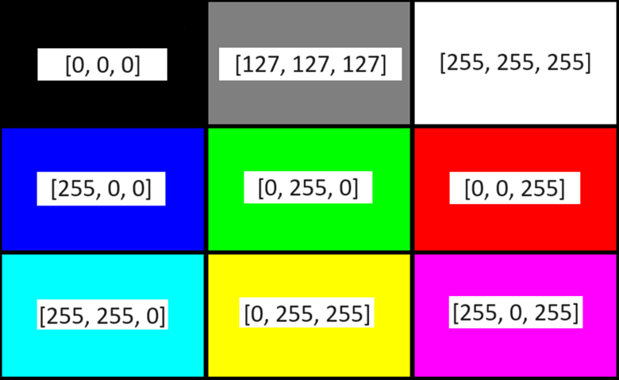

*Grayscale* images use one value rather than three to denote intensity. Grayscale images are easy to work with for image processing operations because there is only one value per pixel. One important operation is called *convolution*, which takes a larger matrix (the image) and a smaller matrix (the *kernel*, made of up of *weights*). For each element in the larger matrix, the element and its surrounding elements are multiplied element-wise with the kernel and summed. The result is the element of the new matrix created by this operation. A simple example is below:

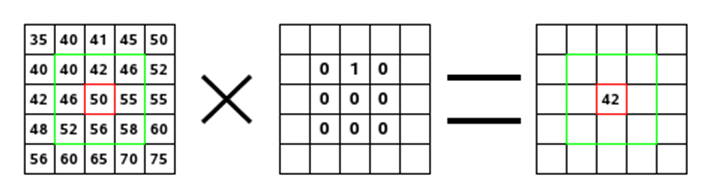

From https://docs.gimp.org/2.8/en/plug-in-convmatrix.html

Different kernels create different effects on the image. To *blur* an image, simply use a kernel that averages the nearby pixels. For a 3x3 kernel, this would be a matrix consisting only of 1/9.

## Sobel Filters

*Sobel filters* use a kernel to highlight changes in intensity, which is useful for edge detection. Typically, two kernels using discrete differentiation are used to determine an approximation of the derivative in the x and y directions, seen below.

From https://homepages.inf.ed.ac.uk/rbf/HIPR2/sobel.htm

The result of the convolution at each point is the component of the gradient in the positive direction (right for x and down for y). The gradient has a magnitude and direction, calculated below. These gradients are used to detect the direction and intensity of edges in an image, which is helpful for object detection and other computer vision applications.

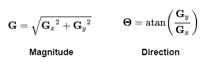

From https://theailearner.com/2019/05/24/first-order-derivative-kernels-for-edge-detection/

## Code (Featuring the Core Module)

Let’s begin coding. You will need a C++ source file, some way to compile and execute it, and an image. It doesn’t really matter what you use, as long as it’s in color. I downloaded a picture of a rather handsome mascot for my project. The reason I am using a Makefile is because to compile programs with OpenCV, it will be necessary to include several modules like *imgproc*, *imgcodecs*, *highgui*, and *core*. I find it easy to set some variables and occasionally change them to fit my needs. Below is my Makefile as an example; naturally, you should change the *inc* and *lib* variables to the paths associated with those folders on your machine.

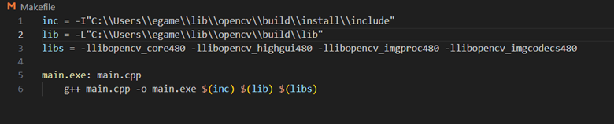

Whether you choose to compile with Makefiles, CMake, straight from the command line, or some other way, make sure the all the modules are included for this part. The names of the modules may differ depending on your version of OpenCV.

We will start simple to make sure OpenCV works. This code will simply create a Mat, read the image into it, and display it in a window.

    #include <iostream>
    #include <opencv2/opencv.hpp>

    int main() {
        cv::Mat image;
        image = cv::imread("sparty.jpg");

        if (image.empty()) {
            std::cerr << "Image not read" << std::endl;
            return 1;
        }

        cv::imshow("Original Image", image);
        cv::waitKey(0);
        return 0;
    }

- *imread* converts the image data into the Mat data format for use in OpenCV
- Then, we check if the image is empty before trying to display it
- *imshow* opens a window containing the Mat so we can see it
- *waitKey* keeps the window open until a key is pressed. The argument is the delay in milliseconds, and with a value of zero or less the function will wait indefinitely

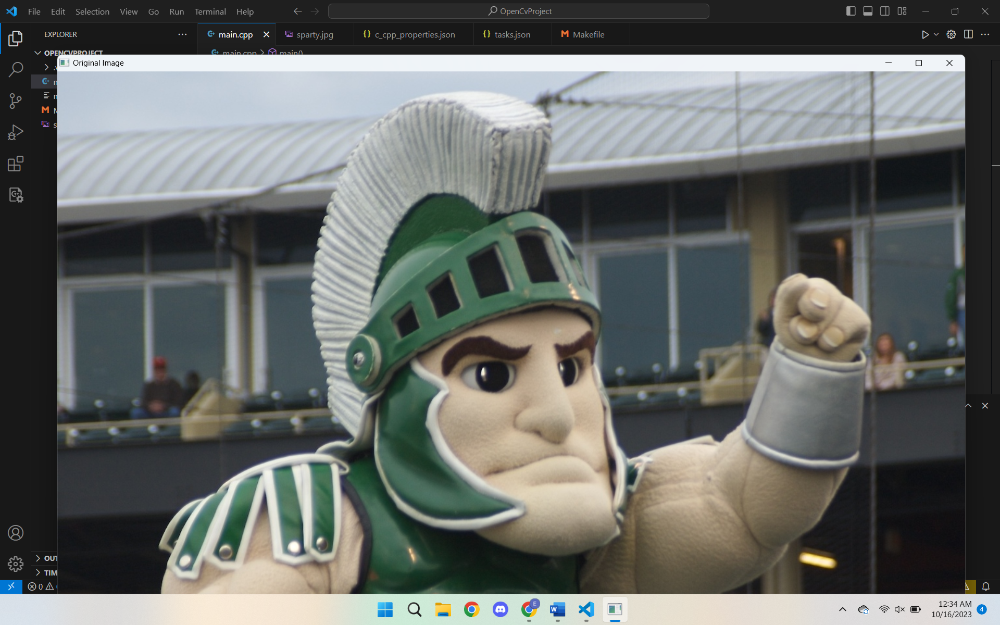

The image I chose is a bit too large for my laptop display, which isn’t helpful for the analysis we will do later. To remedy this, I will use the *resize* function before displaying the image.

    cv::resize(image, image, cv::Size(640, 480));

- The first argument is the *source* Mat, the Mat being read from
- The second argument is the *destination*, which can be a new Mat. I am using the same Mat for this example since I will have no need for the original Mat
- The third argument is a *Size* object, for which I am using magic numbers

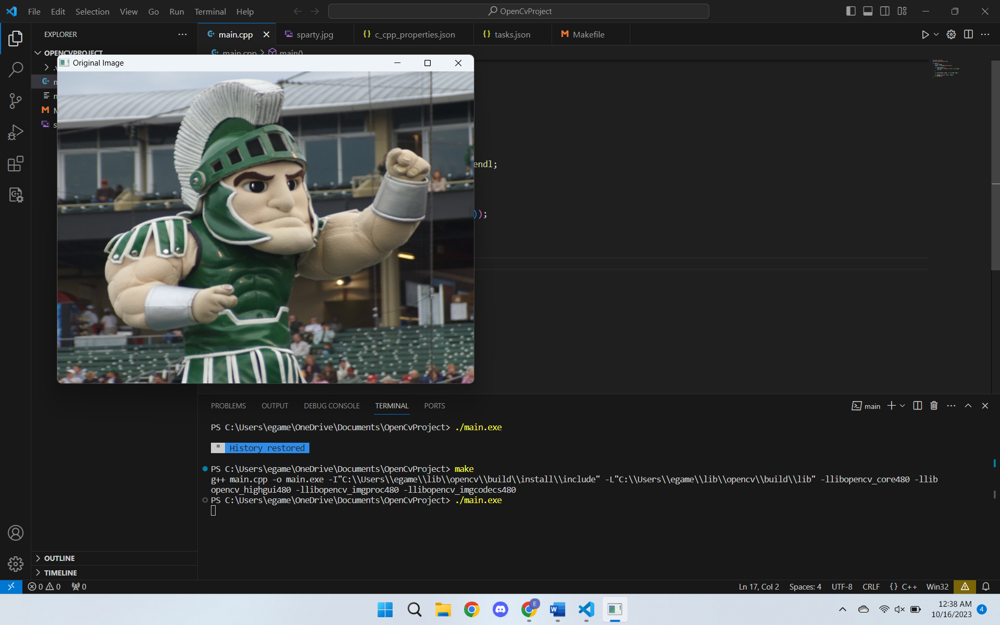

This looks nicer. Let’s start modifying the image. To create a new image in grayscale and display both images at once, I’ll replace some code at the end with:

    cv::Mat bwImage;
    cv::cvtColor(image, bwImage, cv::COLOR_BGR2GRAY);

    cv::imshow("Original Image", image);
    cv::imshow("Grayscale Image", bwImage);
    cv::waitKey(0);
    return 0;

Here, *cv::COLOR_BGR2GRAY* is an enumerator from *cv::ColorConversionCodes*. There are many conversions that OpenCV can perform, but this is the one we need now.

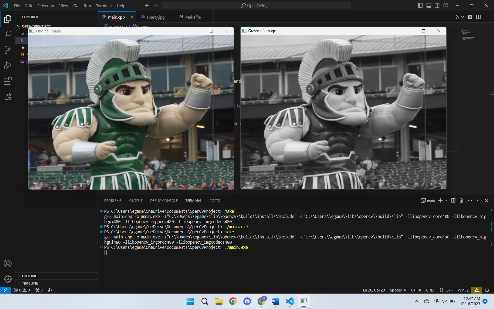

A good start. Now we will perform convolution with a Sobel filter on the grayscale image. Change the end of the main function to this:

    cv::Mat xImage, yImage;
    cv::Sobel(bwImage, xImage, image.depth(), 1, 0);
    cv::Sobel(bwImage, yImage, image.depth(), 0, 1);

    cv::imshow("Original Image", image);
    cv::imshow("Sobel X Image", xImage);
    cv::imshow("Sobel Y Image", yImage);
    cv::waitKey(0);
    return 0;

- The first argument of the Sobel function is the source, and the second is the destination
- The third argument is the depth. You can use the depth() function of a Mat for this
- The fourth and fifth arguments are dx and dy. As mentioned before, we want the first derivative of either the x or y direction.

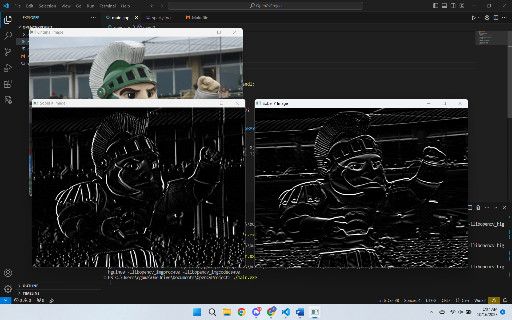

Note the difference in the edges shown between the two images. This is because two different kernels are used in the convolution. This allows the components of the gradient magnitude and direction to be calculated. Using some of the math above, I made this function to draw lines on the image to show the gradients on the image. Every ten pixels, this function reads the values from the images with the x and y sobel filters applied then draws a line based on the magnitude and direciton.

    cv::Mat DrawGradients(const cv::Mat & srcImage, const cv::Mat &xImage, const cv::Mat &yImage) {
        cv::Mat newMat;
        cv::cvtColor(srcImage, newMat, cv::COLOR_GRAY2BGR);
        int interval = 10;

        for (int y = 0; y <= newMat.rows; y += interval) {
            for (int x = 0; x <= newMat.cols; x += interval) {
                double Gx = xImage.at<uint8_t>(y, x) / 255.0;
                double Gy = yImage.at<uint8_t>(y, x) / 255.0;
                double G = sqrt(Gx * Gx + Gy * Gy);
                double dir = atan2(Gy, Gx);
                int xComponent = G * interval * cos(dir);
                int yComponent = G * interval * sin(dir);

                cv::Point p1 = cv::Point(x, y);
                cv::Point p2 = cv::Point(x + xComponent, y + yComponent);
                cv::line(newMat, p1, p2, cv::Scalar(0, 0, 255));
            }
        }

        return newMat;
    }
- I am using *.at* to get the value of the pixel at that point of the image. It must be specified as a *uint8_t*, the type of the values in the Mat. This will be different for different image formats, but this works for this tutorial
- I also divide the values by 255.0 to both normalize the values on a scale of 0 to 1 and convert it to a double for more precise math
- The *sqrt* function gets the square root, which we need for the gradient magnitude
- the *atan2* function is a two-argument arctangent function so that the full range of angles can be considered
- Using the point constructor allows me to denote a point on the image in a way OpenCV understands
- the *line* function draws a line on the source image (newMat) from the first to the second point in a color, which I denote with *cv::Scalar(0, 0, 255)* which represents red in BGR. I used *cv::cvtColor* earlier so I could do this, as otherwise the lines would also be in grayscale

Use the function like this; be sure to show the image in a new window too.

    cv::Mat gradientImage = DrawGradients(bwImage, xImage, yImage);

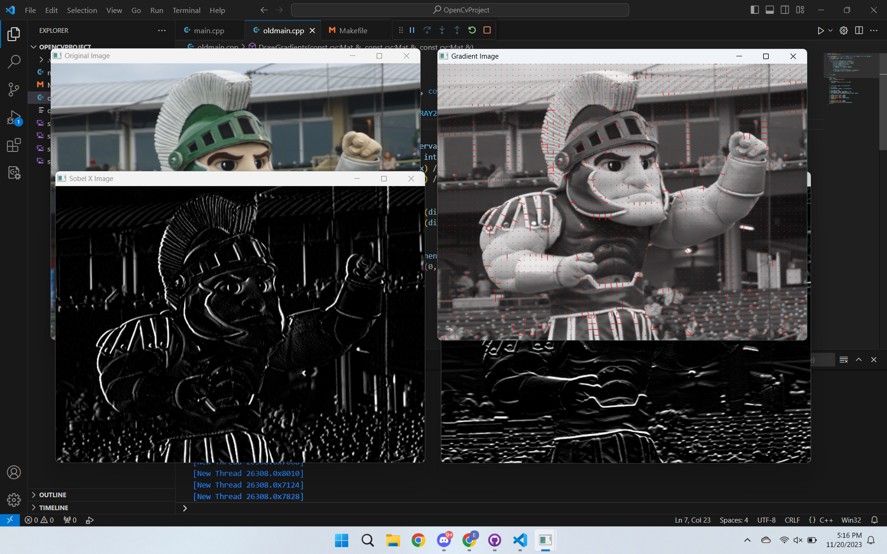

Note that the direction of the gradient is in the direction of change, so the lines don't necessarily outline the edges in the image. However, this information can be used for edge detection.

To finish this part, I will write the images to new files. To do so, add this to the end of the main function:

    cv::imwrite("sparty_x.png", xImage);
    cv::imwrite("sparty_y.png", yImage);
    cv::imwrite("sparty_gradient.png", gradientImage);

This concludes the beginning part of the tutorial. This is what all my code looks like:

    #include <iostream>
    #include <opencv2/opencv.hpp>

    cv::Mat DrawGradients(const cv::Mat & srcImage, const cv::Mat &xImage, const cv::Mat &yImage) {
        cv::Mat newMat;
        cv::cvtColor(srcImage, newMat, cv::COLOR_GRAY2BGR);
        int interval = 10;

        for (int y = 0; y <= newMat.rows; y += interval) {
            for (int x = 0; x <= newMat.cols; x += interval) {
                double Gx = xImage.at<uint8_t>(y, x) / 255.0;
                double Gy = yImage.at<uint8_t>(y, x) / 255.0;
                double G = sqrt(Gx * Gx + Gy * Gy);
                double dir = atan2(Gy, Gx);
                int xComponent = G * interval * cos(dir);
                int yComponent = G * interval * sin(dir);

                cv::Point p1 = cv::Point(x, y);
                cv::Point p2 = cv::Point(x + xComponent, y + yComponent);
                cv::line(newMat, p1, p2, cv::Scalar(0, 0, 255));
            }
        }

        return newMat;
    }

    int main() {
        cv::Mat image;
        image = cv::imread("sparty.jpg");

        if (image.empty()) {
            std::cerr << "Image not read" << std::endl;
            return 1;
        }

        cv::resize(image, image, cv::Size(640, 480));

        cv::Mat bwImage;
        cv::cvtColor(image, bwImage, cv::COLOR_BGR2GRAY);

        cv::Mat xImage, yImage;
        cv::Sobel(bwImage, xImage, image.depth(), 1, 0);
        cv::Sobel(bwImage, yImage, image.depth(), 0, 1);
        cv::Mat gradientImage = DrawGradients(bwImage, xImage, yImage);

        cv::imshow("Original Image", image);
        cv::imshow("Sobel X Image", xImage);
        cv::imshow("Sobel Y Image", yImage);
        cv::imshow("Gradient Image", gradientImage);
        cv::waitKey(0);

        cv::imwrite("sparty_x.png", xImage);
        cv::imwrite("sparty_y.png", yImage);
        cv::imwrite("sparty_gradient.png", gradientImage);
        return 0;
    }

By now, you should understand Mat objects, how to read and write images, and how to perform some basic operations on Mats.

## Live video

For this part, you will need to use the *video* and *videoio* modules in addition to the ones used in the previous part. This will allow you to process and capture video. Start with this code:

    #include <iostream>
    #include <opencv2/opencv.hpp>

    int main() {
        cv::VideoCapture cam(0);

        if (!cam.isOpened()) {
            std::cerr << "Could not open the camera." << std::endl;
            return 1;
        }

        cv::Mat frame;
        bool running = true;
        while (running) {
            cam >> frame;

            if (frame.empty()) {
                std::cerr << "Could not capture a frame." << std::endl;
                break;
            }

            cv::imshow("Camera Feed", frame);

            if (cv::waitKey(1) == 'q') {
                running = false;
            }
        }

        cam.release();

        return 0;
    }

- The *VideoCapture* constructor takes a device ID, the default laptop camera should be 0
- Use *cam >> frame* to place the current frame from the camera into the frame Mat
- Repeatedly use *imshow* to update the window
- The *waitkey* function returns an integer corresponding to the key pressed on the keyboard (or -1 if no key is pressed during the time interval). Adding a delay of one millisecond allows the program to read input from the keyboard
- Release the camera at the end of the program, to be clean

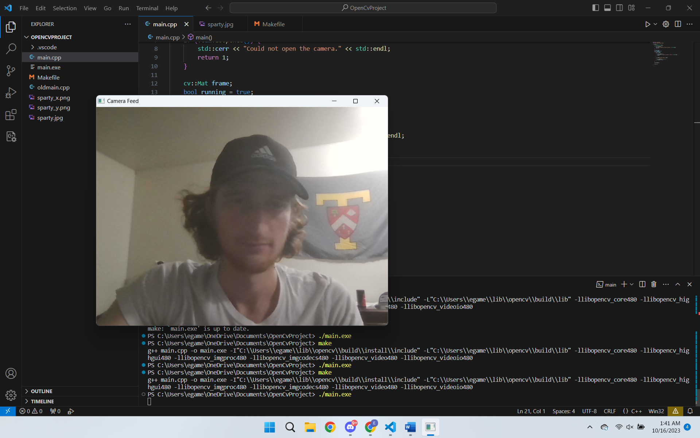

Hey, that’s me. I promise the window shows video. Normal video gets boring after a while, so let’s apply some filters. After capturing the frame but before placing it in the window, change the Mat to grayscale add the familiar Sobel filter with this code:

    cv::cvtColor(frame, frame, cv::COLOR_BGR2GRAY);
    cv::Sobel(frame, frame, frame.depth(), 1, 0);
    cv::imshow("Camera Feed", frame);

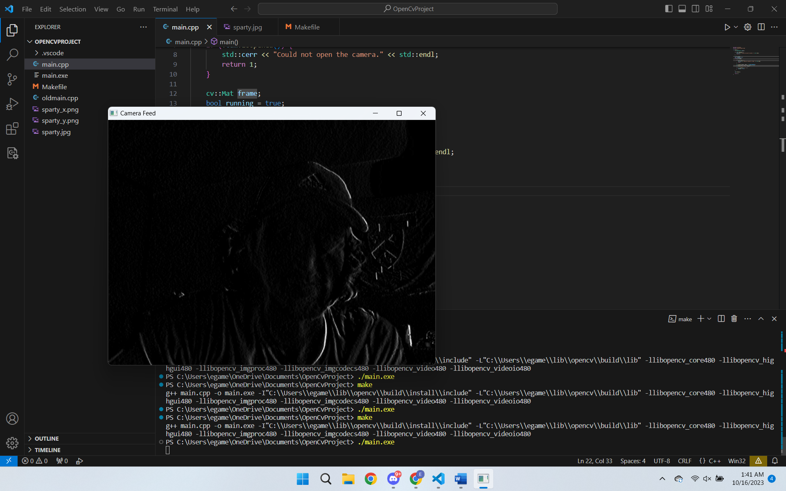

Now, for fun, I'll put on the gradients like I did in the previous section. Add the DrawGradients function to the file, then replace the above code with:

    cv::cvtColor(frame, frame, cv::COLOR_BGR2GRAY);
    cv::Sobel(frame, xImage, frame.depth(), 1, 0);
    cv::Sobel(frame, yImage, frame.depth(), 0, 1);
    frame = DrawGradients(frame, xImage, yImage);
    cv::imshow("Camera Feed", frame);

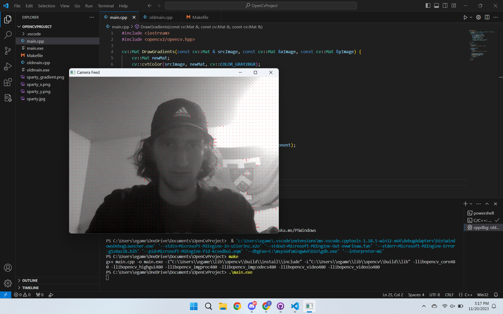

Admittedly, he gradients are a bit difficult to detect on my camera because the image isn't very sharp.

By now, you should understand how to use the VideoCapture class to use a camera for live video and how to perform operations on frames from the capture. This is all my code from this part:

    #include <iostream>
    #include <opencv2/opencv.hpp>

    cv::Mat DrawGradients(const cv::Mat & srcImage, const cv::Mat &xImage, const cv::Mat &yImage) {
        cv::Mat newMat;
        cv::cvtColor(srcImage, newMat, cv::COLOR_GRAY2BGR);
        int interval = 10;

        for (int y = 0; y <= newMat.rows; y += interval) {
            for (int x = 0; x <= newMat.cols; x += interval) {
                double Gx = xImage.at<uint8_t>(y, x) / 255.0;
                double Gy = yImage.at<uint8_t>(y, x) / 255.0;
                double G = sqrt(Gx * Gx + Gy * Gy);
                double dir = atan2(Gy, Gx);
                int xComponent = G * interval * cos(dir);
                int yComponent = G * interval * sin(dir);

                cv::Point p1 = cv::Point(x, y);
                cv::Point p2 = cv::Point(x + xComponent, y + yComponent);
                cv::line(newMat, p1, p2, cv::Scalar(0, 0, 255));
            }
        }

        return newMat;
    }

    int main() {
        cv::VideoCapture cam(0);

        if (!cam.isOpened()) {
            std::cerr << "Could not open the camera." << std::endl;
            return 1;
        }

        cv::Mat frame, xImage, yImage;
        bool running = true;
        while (running) {
            cam >> frame;

            if (frame.empty()) {
                std::cerr << "Could not capture a frame." << std::endl;
                break;
            }

            cv::cvtColor(frame, frame, cv::COLOR_BGR2GRAY);
            cv::Sobel(frame, xImage, frame.depth(), 1, 0);
            cv::Sobel(frame, yImage, frame.depth(), 0, 1);
            frame = DrawGradients(frame, xImage, yImage);
            cv::imshow("Camera Feed", frame);

            if (cv::waitKey(1) == 'q') {
                running = false;
            }
        }

        cam.release();

        return 0;
    }

## Conclusion

OpenCV is a huge library with many functionalities. In the functions I used throughout this tutorial, there are several optional parameters which I chose not to detail for the sake of simplicity. Even then, this is only a small corner of the library; OpenCV includes modules for 3D reconstruction, feature detection, deep neural networks, object detection, iOS support, CUDA support, and much more. My hope with this tutorial is that I provided a good foundation of knowledge about computer vision and the tools to explore more of the library and its features.

