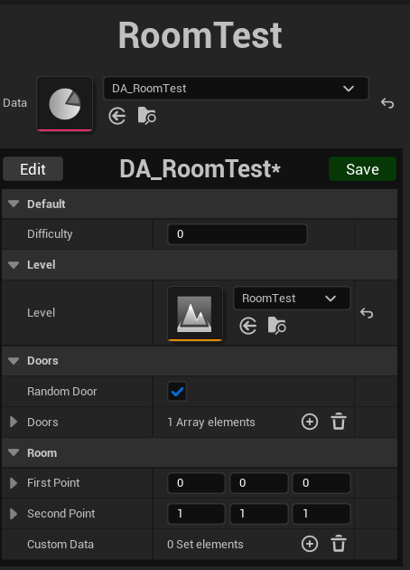

# Procedural Dungeon Plugin For Unreal Engine

Paul Schulte

Over the past few years, the Roguelike (or Rogue*lite*) genre of games have seen a rise in popularity. For those who aren’t familiar with the genre, these games focus on the player going through a randomly generated map, defeating increasingly strong enemies all while the player gets progressively stronger as well through stronger items. A large emphasis is placed on the randomly generated map due to the fact that the player is expected to run through it dozens, if not hundreds of times, and that can easily get repetitive if each run isn’t much different than the last. That’s why I was interested in checking out and experimenting with this plugin.

## Library Overview
This plugin is developed by GitHub user [BenPyton](https://github.com/BenPyton) for, as of writing this, Unreal Engine versions 4.2, 5.0, 5.1, and 5.2. It provides a variety of resources to help with generating 3D dungeons using custom rooms and generation logic. It also has very good documentation that explains how to use the provided features along with many example use cases and how they could be implemented.

## Disclaimer
Before I start explaining how to use the plugin, I should specify that I’m using version 3.0.0 of the plugin with Unreal version 5.2.1, Visual Studio 2022, and Windows 10. You may get different results by using different versions, and this information could become obsolete with future updates.

## Setting Up The Unreal Project
Before you get started with the plugin, you’ll need to install some basic things to get the project set up. If you already have Unreal installed and are adding this to an existing project, feel free to skip to [Installing The Plugin](#installing-the-plugin).

### Installing Unreal Engine
The first and most important thing you need to install is [Unreal Engine](https://store.epicgames.com/en-US/download). To do this, you have to install the Epic Games Launcher. Once that is installed, go to the Unreal Engine section on the left.


From there, add a new engine version. Select 5.2.1 by selecting the drop down next to the default version. (Note: I already have it installed, so it does not appear on my list of options).


### Installing Visual Studio
Once Unreal is installed, download [Visual Studio 2022](https://visualstudio.microsoft.com/downloads). This is used by Unreal to generate C++ files and is the default recommended editor. While it is being installed, you will be prompted to select some components to install. Make sure you select “.NET desktop environment”, “Desktop development with C++”, and “Game development with C++”.


### Installing The Demo Project
I’m using the provided demo project. This is not a requirement, however I found it to be useful for testing the library as a whole. Just go to the [Demo Project repository](https://github.com/BenPyton/DungeonExample) and download the project. From there, extract the zip file and open the DungeonExample.uproject file. It should then open up the project in Unreal. You will see many errors pop up saying that there are missing classes/files. This will get fixed once the plugin is installed. You can now close the project.

### Installing The Plugin
Now for the plugin itself. Download it from its [GitHub repository](https://github.com/BenPyton/ProceduralDungeon) and extract it. Then move the folder into the “Plugins” folder in the project’s root directory. If you are using the demo project or don’t already have any plugins installed, create the folder yourself. Once that is done, open the .uproject file again to launch the project. You will most likely be prompted to resolve something with the plugin. Accept it, and then the project will open.

## Using The Plugin
### Exploring The Demo Project
Once everything is set up, you can finally use the plugin. In the demo project, once you hit run and then the Enter key, a random dungeon will be generated.


This is done using the “BP_MyDungeonGenerator” actor in the level. This extends the plugin’s “DungeonGenerator” class and is where all of the logic goes. If you click to edit it in the level hierarchy, you will be taken to the class blueprint. For those unfamiliar with Unreal’s blueprint system, it consists of drag and drop modules that let you easily see and configure logic flows in the game. The functions themselves are written in C++, but their use is abstracted to the blueprint.

### Default Configuration
Back to the blueprint page. There will be several tabs across the top for the class functions, but we’ll get to that in a bit. First, let’s see the details of class on the right. Most of it is generic Unreal stuff, so I’m just going to focus on the “Default” and “Procedural Generation” sections.


Starting at the top, we have several default rooms for “Start”, “End”, and “Key”. These are Room Data objects. We’ll get to how to create those later, but for now, just know that they store information about each room segment including the physical room itself. These default rooms are pretty self-explanatory. The player spawns in the Start Room, a key spawns in the Key Room, and the end of the level is the End Room.

Next there are “Random Rooms”. These are all of the rooms in between such as random corridors, staircases, etc.

Then there are “Room Before Key” and “Additional Rooms”. These are also self-explanatory. They determine the minimum number of rooms should be placed before a key room is placed and then the minimum number of additional rooms should be placed before the end room is placed.

On to the Procedural Generation section. The “Use Generator Transform” checkbox determines where the first room is spawned. If unchecked, it defaults to (0, 0, 0) without any rotation. If it is enabled, the first room will be transformed to match the position and rotation of the DungeonGenerator actor.

“Generation Type” determines what algorithm is used to generate the dungeon. “Depth First” results in a more direct and linear dungeon, while “Breadth First” results in one with longer dead ends.

Lastly, there is the “Seed Type”. This determines the seed used for the random generation. “Random” will use a random seed each time, while “Auto Increment” and “Fixed” both let you provide a set seed for repeatable results. The difference with “Auto Increment” is that if the DungeonGenerator is called again, the seed will be incremented by the given amount. This is useful if there are multiple levels or worlds in a single playthrough. Using the one seed, every world will still be different, however they will be generated in the same order every time.

### Overriding Functions
Now for the functions at the top I mentioned before. Those are the class functions. There are a few that need to be overridden as well as a few optional ones that can give you more control over the generation process. For this blog, I’ll just go over the required ones and include example implementations using Unreal Blueprints followed by the rough C++ equivalent implemented in a class extending `ProceduralDungeon`.

First is “Choose First Room”. This is pretty straightforward. All it does is determine which room to use as the start room. In the demo project, this is just the “Start Room” defined earlier, however additional logic can be added here to have a variety of start rooms to choose from.


```c++
URoomData* ChooseFirstRoom() {
    return StartRoom; /// Pointer to a URoomData object
}
```

Then there is “Choose Next Room”. This is the core of how rooms are placed. You can add whatever you want in here to determine room placement. All that has to be returned is a Room Date object.


```c++
URoomData* ChooseNextRoom(const URoomData* CurrentRoom, const FDoorDef& DoorData) {
    // Graph is a pointer to a DungeonGraph object
    // KeyRoom is a pointer to a URoomData object
    // HasAlreadyRoomData returns true if the given room has already been placed
    bool hasKeyRoom = Graph->HasAlreadyRoomData(KeyRoom);
    // Count returns the current number of placed rooms
    int32 numRooms = Graph->Count();

    // RoomBeforeKey is the setting from Default Configuration
    // Returns the Key Room if one hasn't been placed and there are enough rooms placed already
    if (!hasKeyRoom && numRooms > RoomBeforeKey) {
        return KeyRoom;
    }

    // AdditionalROoms is the setting from Default Configuration
    // Returns the End Room if a Key Room hasn't been placed and enough total rooms have been placed
    if (hasKeyRoom && numRooms > RoomBeforeKey + AdditionalRooms) {
        return EndRoom;
    } else {
        // RandomRooms is the setting from Default Configuration
        // GetRoomDataWithExclusion returns a random room excluding the provided one
        URoomData* newRoom = GetRoomDataWithExclusion(RandomRooms, [CurrentRoom]);
        return newRoom;
    }
}
```

Next is “Continue To Add Room”. This determines if more rooms should be added. In the example, it just checks to see if the End Room has been placed yet.


```c++
bool ContinueToAddRoom() {
    // Only continue placing rooms if the End Room hasn't been placed
    return !Graph->HasAlreadyRoomData(EndRoom);
}
```

Then there is “Choose Door”. I’ll go over this in more detail once I get to Room Data objects, but every room has specific location(s) that doors can spawn, which lead to other rooms. The logic here determines what should be placed in a door space. In the example, it only chooses between a door and wall entity, however this can be expanded to include different kinds of doors, walls specific per room, etc.


```c++
Door ChooseDoor(const URoomData* CurrentRoom, const URoomData* NextRoom, const UDoorType* DoorType) {
    if (CurrentRoom->IsValid() && NextRoom->IsValid()) {
        // Door object representing a normal door
        return Door;
    }

    // Door object representing no door, or a wall
    return Wall;
}
```

Lastly, there is “Is Valid Dungeon”. This determines whether or not the current generation is considered valid. In the example, it just checks that there is both a key and end room placed. If this returns true, the rooms will be placed into the level. If it returns false, the dungeon will be discarded and it will try to generate a new dungeon.


```c++
bool IsValidDungeon() {
    bool hasKeyRoom = Graph->HasAlreadyRoomData(KeyRoom);
    bool hasEndRoom = Graph->HasAlreadyRoomData(EndRoom);

    // Dungeon is valid if both Key and End Rooms have been placed
    return hasKeyRoom && hasEndRoom;
}
```

### Custom Rooms
At long last, we’re finally talking about rooms. These are broken down into Room Data and Room Levels.

To start, you can go to the Content Browser, then to Content > Data > Rooms. Then right-click go to Procedural Dungeon and select Room Data.


From there, you can either use the default RoomData class or create your own to hold custom data. The demo creates “BP_MyRoomData”, which extends the base RoomData class.


Now for the physical rooms, or Room Levels. Go back to the Content directory and down to Maps > Rooms. Right click and create a new Level. Double click on the new Level, and it will switch to it.


Go back to the level viewer and change the editor mode from Selection to Dungeon Room. This is a custom mode made to easily create and edit rooms.


When you do this, you will be prompted to reparent this level with its associated Room Data. If that doesn’t work, manually assign the Room Data you created as well as the new Room Level. With that completed, you can now start building the room.



You can place down whatever assets you like and can treat this just like any other Unreal level. Just click and drag the white corners of the red cube to change the bounding box for the room. After that is done, you can go back to the top left and select “Door” to place possible door locations. These are the blue rectangles. They even automatically snap to the grid for easier placement. (Note: I recommend changing the View Mode at the top from “Lit” to “Unlit” for the demo project. Otherwise if you don’t include any light sources, the entire level is pitch black)


## Conclusion
As you can see, this is a very robust and customizable plugin. It takes care of most of the hard parts and allows you to focus on the logic, design, and implementation of the game itself. It is also (as of the time of writing this) still being actively developed, so if you find any bugs or have new feature ideas, there’s a good chance you’ll get a response.

If you’re at all interested in game development and Roguelikes, or even if you’re just looking for a fun programming project, I’d highly recommend checking out this plugin. I know I’ll be using it more in the future.