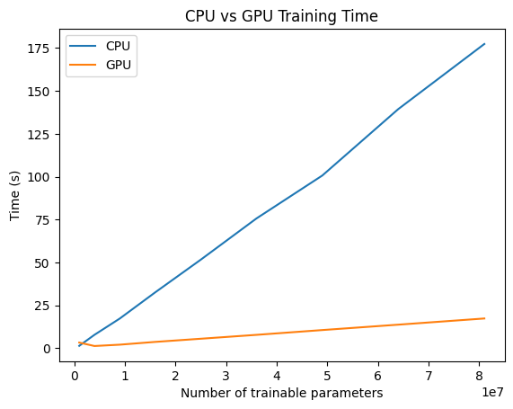

# Review of PyTorch C++ API

## Pre-requisites
* Knowledge of using PyTorch in Python
* Basic C++ knowledge

## Introduction
PyTorch is a library for Python for machine learning. It is written in C++ and Python is used to interface with the library. This makes it have the performance of C++ while being easy to use. So why use the C++ API? PyTorch gives the following [reasons](https://pytorch.org/tutorials/advanced/cpp_frontend.html):
* The ability to make use of C++ multi-threading, since Python has a global interpreter lock which prevents true multi-threading.
* It can be used to integrate with existing C++ code.
* Python's low performance is too much of a cost for your application.

Of course, You may just prefer writing C++ rather than Python.

Note on performance between Python and C++: If most of your program is waiting on PyTorch, then moving from Python to C++ won't make a significant difference in performance. This is because PyTorch is written in C++ with Python bindings, allowing it to be used in Python. As a result, PyTorch function calls in Python are calling C++ compiled code, so PyTorch won't be limited by Python's performance. The only performance gain you will get is from the pure Python code that you may have. If there's a specific part of your program that is taking a long time, then you can move that part to C++ with Python bindings to get a performance boost, rather than moving the entire program to C++.

The C++ API is designed to be extremely similar to how PyTorch is used in Python, so that it is straightforward to use. One of the tips that they give is to write the code like you would in Python, while abiding to C++ syntax [[2]](#Sources).

## Installation
The setup for the library is pretty straightforward if you only want to use the CPU for PyTorch. [These instructions worked for me without modification.](https://pytorch.org/cppdocs/installing.html)
The installation for GPU support is a lot more involved since the CUDA toolkit from Nvidia is needed to successfully build PyTorch, and there seems to be a problem with the library for the 12.1 version of CUDA.


<!-- Dropdown for installation steps: -->
<details>
<summary>Steps I followed for installing PyTorch with GPU Support</summary>
Firstly, you need a CUDA-compatible device. A list of CUDA-enabled devices are found here: https://developer.nvidia.com/cuda-gpus

Then, download libtorch from https://pytorch.org/get-started/locally/
I selected `Nightly + Windows + LibTorch + C++/Java + CUDA 12.1` and downloaded the release version of the library.

The `libtorch` folder inside of the downloaded zip file should be moved to a convenient location.

Then I downloaded the corresponding 12.1 version of the CUDA toolkit from https://developer.nvidia.com/cuda-downloads by navigating to "Archive of Previous CUDA Releases" at the bottom of the page. When selecting the target platform, my selections were `Windows + x86_64 + 10 + exe (local)`. Downloading and running the installer should install CUDA 12.1 on the system.

Doing `nvcc --version` in the command prompt should show the version of CUDA installed.

This is typically all the steps needed to start building programs with PyTorch, but there is a problem where CMake gives an error stating that it failed to find nvToolsExt. A solution I found from https://discuss.pytorch.org/t/failed-to-find-nvtoolsext/179635/4 is to install the CUDA toolkit version 11.8, which includes the nvToolsExt library. So I installed CUDA 11.8 following the same steps as above, and doing a custom installation for only the Nsight NVTX component under the CUDA category. 

After all of these steps, I was able to compile the CUDA-enabled LibTorch library with the MSVC compiler with the following CMakeLists.txt file and console commands:
```cmake
cmake_minimum_required(VERSION 3.12)
project(example)

set(CMAKE_CXX_STANDARD 20)

find_package(Torch REQUIRED)
set(CMAKE_CXX_FLAGS "${CMAKE_CXX_FLAGS} ${TORCH_CXX_FLAGS}")

add_executable(example example.cpp)
target_link_libraries(example "${TORCH_LIBRARIES}")

# The following code block is suggested to be used on Windows.
# According to https://github.com/pytorch/pytorch/issues/25457,
# the DLLs need to be copied to avoid memory errors.
if (MSVC)
  file(GLOB TORCH_DLLS "${TORCH_INSTALL_PREFIX}/lib/*.dll")
  add_custom_command(TARGET example
                     POST_BUILD
                     COMMAND ${CMAKE_COMMAND} -E copy_if_different
                     ${TORCH_DLLS}
                     $<TARGET_FILE_DIR:example>)
endif (MSVC)
```
This CMakelists.txt file is from https://pytorch.org/cppdocs/installing.html

The console commands I used to build the program were (starting in the path where the example.cpp file is located, and assuming the libtorch folder is in the same directory):
```console
mkdir build
cd build
cmake -DCMAKE_PREFIX_PATH="${CMAKE_CURRENT_SOURCE_DIR}/../libtorch" ..
cmake --build . --config Release && Release\example.exe
```
</details>

## Documentation
The documentation can be found [here.](https://pytorch.org/cppdocs/index.html) There is a significant portion of functions that are missing documentation.

## Minimal Example
The installation guide provides a small example to try when getting the library set up. It is a simple program that creates a 2x3 tensor of random numbers between 0 and 1 and prints it to std::cout.
The installation guide gives the following example:
```cpp
#include <torch/torch.h>
#include <iostream>

int main() {
  torch::Tensor tensor = torch::rand({2, 3});
  std::cout << tensor << std::endl;
}
```
Output:
```cpp
 0.3828  0.0383  0.8342
 0.3193  0.1213  0.6756
[ CPUFloatType{2,3} ]
```

This is the equivalent Python code:
```py
import torch

tensor = torch.rand(2, 3)
print(tensor)
```
Output:
```cpp
tensor([[0.5879, 0.5029, 0.1522],
        [0.0165, 0.1526, 0.8701]])
```

Aside from the random numbers, the results are pretty similar. If we use a large tensor size, such as [2,3,4], we see the following output:

C++ Output:
```cpp
(1,.,.) = 
  0.6969  0.9800  0.9234  0.7233
  0.3798  0.5593  0.0248  0.4228
  0.7216  0.3585  0.0960  0.8017

(2,.,.) =
  0.9224  0.8513  0.3186  0.1017
  0.5374  0.5361  0.1317  0.0175
  0.2660  0.0787  0.0405  0.9669
[ CPUFloatType{2,3,4} ]
```
Python Output:
```cpp
tensor([[[0.9271, 0.0307, 0.6839, 0.0347],
         [0.2656, 0.7255, 0.8338, 0.8732],
         [0.1196, 0.7630, 0.2806, 0.6407]],

        [[0.9917, 0.8121, 0.7952, 0.1987],
         [0.9438, 0.6141, 0.3507, 0.5229],
         [0.8222, 0.0517, 0.3564, 0.0864]]])
```
The C++ output includes the index for each 2D slice of the tensor, which can be useful for debugging. You can easily lose track of which slice you're looking at in Python, especially if you printed out a large tensor.

## Creating a Module
A Module is the primary class for defining neural networks in PyTorch. It can hold other Module instances as attributes, and PyTorch will keep track of them as children in a tree structure when registered using `register_module`. This is useful for saving and loading models, moving models between types and devices, and most importantly for training. Here is an example Module with 3 fully connected layers, taking 1 value and outputting 2 values, with the flexible `dims` parameter:
```cpp
struct Net : torch::nn::Module {
  torch::nn::Linear fc1, fc2, fc3;

  Net(int64_t dims) : fc1(1, dims), fc2(dims, dims), fc3(dims, 2) {
    register_module("fc1", fc1);
    register_module("fc2", fc2);
    register_module("fc3", fc3);
  }
};
```
Note: If you want it to be a `class` instead of a `struct`, you have to make the inheritance, constructor, and `forward` method public (`forward` will be talked about later).

The example above is the "C++ way" of defining the constructor for a Module, which is best C++ practice. The member initializer list in the constructor avoids the extra default initialization of the members. The API allows for the "Python way" of initializing and registering submodules:
```cpp
struct Net : torch::nn::Module {
  torch::nn::Linear fc1{nullptr}, fc2{nullptr}, fc3{nullptr};

  Net(int64_t dims) {
    fc1 = register_module("fc1", torch::nn::Linear(1, dims));
    fc2 = register_module("fc2", torch::nn::Linear(dims, dims));
    fc3 = register_module("fc3", torch::nn::Linear(dims, 2));
  }
};
```
Here is the equivalent Python code for reference:
```py
class Net(torch.nn.Module):
    def __init__(self, dims):
        super().__init__()
        # These modules are registered automatically; there is no "register_module" method.
        self.fc1 = torch.nn.Linear(1, dims)
        self.fc2 = torch.nn.Linear(dims, dims)
        self.fc3 = torch.nn.Linear(dims, 2)
```
The submodules are initialized to `nullptr`, and then assigned to the result of `register_module` inside the body of the constructor. This is at the cost of an extra constructor call for each submodule for initializing them to `nullptr`. Unless this is happening frequently, then the cost is pretty small. This is because `torch::nn::Linear` is an ["alias"](https://github.com/pytorch/pytorch/blob/4a388e70f2c7fedcdef598fb2144cc593452f04d/torch/csrc/api/include/torch/nn/pimpl.h#L206-L214) for a wrapper class template around a `shared_ptr`, called `torch::nn::ModuleHolder`, so assignment to the `shared_ptr` is pretty cheap. The real type "aliased" by `Linear` in this case would be ModuleHolder<LinearImpl>, where LinearImpl is the actual implementation of the Linear module. More details can be found [here](https://pytorch.org/tutorials/advanced/cpp_frontend.html#module-ownership), but overall this is to simplify the API and make it more similar to how it is done in Python. You can circumvent the use of the ModuleHolder wrapper class (or shared_ptr) by using the actual implementation class, but some features only support the wrapper class such as loading and saving. So there are options for advanced C++ users to be more efficient, while also being easy for users who are less interested in that to use the library.

You may have noticed that the features of the linear layer are specified by the int64_t type. This is a signed 64-bit integer. I'm not entirely sure why Linear is using a signed integer to specify its dimensions, because negative dimensions don't make sense. If you try making a linear layer in Python with negative dimensions, you get an error. I think it would make more sense to use an unsigned integer. I couldn't find any information on why this is the case, and many other values in the library use int64_t as well that could be unsigned. My best guess is that this is to be future-proofed, in case they want to use the negative values to mean something in the future. In any case, I can't imagine why you would need more than $2^{32} - 1$ in or out features in a Linear layer.

## Forward Function
We need to define what happens when we do a forward pass through the network. 
We do this by defining the forward function:
```cpp
struct Net : torch::nn::Module {
  torch::nn::Linear fc1, fc2, fc3;

  Net(int64_t dims) : fc1(1, dims), fc2(dims, dims), fc3(dims, 2) {
    register_module("fc1", fc1);
    register_module("fc2", fc2);
    register_module("fc3", fc3);
  }

  torch::Tensor forward(torch::Tensor x) {
    x = torch::relu(fc1(x));
    x = torch::relu(fc2(x));
    return fc3(x);
  }
};
```
Equivalent Python code:
```py
class Net(torch.nn.Module):
    def __init__(self, dims):
        super().__init__()
        self.fc1 = torch.nn.Linear(1, dims)
        self.fc2 = torch.nn.Linear(dims, dims)
        self.fc3 = torch.nn.Linear(dims, 2)

    def forward(self, x):
        x = torch.relu(self.fc1(x))
        x = torch.relu(self.fc2(x))
        return self.fc3(x)
```

The two `forward` methods look pretty much the same and easy to understand. The C++ `forward` method takes a copy of the passed in `Tensor` so we can reuse the variable. We pass x through each layer and apply ReLU on the output of each layer, except for the last layer so that it can output any value. We can call each layer like a function because they are `ModuleHolder`s, which define `operator()` that just calls the implementation's forward method. So `fc1(x)` is equivalent to `fc1->forward(x)`. The `forward` method is not a virtual function of `Module`, so we don't use the `override` keyword. If `forward` is not defined, and `operator()` is used on a `ModuleHolder` holding your derived `Module` class, the code will not compile because it is a function template, and the compiler will see that `forward` will not be able to be called.

## Training
Let's try training the model we defined above. We will do a simple example of fitting the model to a single data point. Due to the way the model was defined, the input tensor must be of size Bx1 and the output tensor must be of size Bx2, where B is the batch size (1 in this case because of the single data point).

Let's see the Python version first for reference:
```py
import torch

class Net(torch.nn.Module):
    def __init__(self, dims):
        super().__init__()
        self.fc1 = torch.nn.Linear(1, dims)
        self.fc2 = torch.nn.Linear(dims, dims)
        self.fc3 = torch.nn.Linear(dims, 2)

    def forward(self, x):
        x = torch.relu(self.fc1(x))
        x = torch.relu(self.fc2(x))
        return self.fc3(x)

device_type = "cpu"
if torch.cuda.is_available():
    print("CUDA is available, using default CUDA device.")
    device_type = "cuda"
device = torch.device(device_type)

net = Net(10)
print("net: ", net)
# Create the vanilla stochastic gradient descent optimizer that operates on the net's parameters, with a learning rate of 0.01
optimizer = torch.optim.SGD(net.parameters(), lr=0.01)
# Create a random data point on the device we're using
x = torch.rand(1, 1, device=device)
y = torch.rand(1, 2, device=device)
print("x: ", x)
print("y: ", y)
net.to(device) # Move the network to the device
print("y_pred: ", net(x))
# Train the network for 1000 iterations
for i in range(1000):
    y_pred = net(x) # Make the prediction
    loss = torch.nn.functional.mse_loss(y_pred, y) # Compute the loss between the prediction and the actual
    loss.backward() # Compute the gradients
    optimizer.step() # Update the parameters based on the gradients
    optimizer.zero_grad() # Zero the gradients
print("Training finished!")
print("y_pred: ", net(x))
```

Now for the C++ code:
```cpp
#include "torch/torch.h"
#include <iostream>

struct Net : torch::nn::Module {
  torch::nn::Linear fc1, fc2, fc3;

  Net(int64_t dims) : fc1(1, dims), fc2(dims, dims), fc3(dims, 2) {
    register_module("fc1", fc1);
    register_module("fc2", fc2);
    register_module("fc3", fc3);
  }

  torch::Tensor forward(torch::Tensor x) {
    x = torch::relu(fc1(x));
    x = torch::relu(fc2(x));
    return fc3(x);
  }
};

int main() {
  std::string device_type = "cpu";
  if (torch::cuda::is_available()) {
    std::cout << "CUDA is available, using default CUDA device." << std::endl;
    device_type = "cuda";
  }
  torch::Device device(device_type);
  
  torch::nn::ModuleHolder<Net> net(10);
  std::cout << "net: " << net << std::endl;
  torch::optim::SGD optimizer(net->parameters(), 0.01);
  torch::Tensor x = torch::rand({1, 1}, device);
  torch::Tensor y = torch::rand({1, 2}, device);
  std::cout << "x: " << x << std::endl;
  std::cout << "y: " << y << std::endl;
  net->to(device);
  std::cout << "y_pred: " << net(x) << std::endl;
  for (size_t i = 0; i < 1000; ++i) {
    torch::Tensor y_pred = net(x);
    torch::Tensor loss = torch::mse_loss(y_pred, y);
    loss.backward();
    optimizer.step();
    optimizer.zero_grad();
  }
  std::cout << "Training finished!" << std::endl;
  std::cout << "y_pred: " << net(x) << std::endl;
}
```
Here's the output if CUDA is not available:
```cpp
net: Net(
  (fc1): torch::nn::Linear(in_features=1, out_features=10, bias=true)
  (fc2): torch::nn::Linear(in_features=10, out_features=10, bias=true)
  (fc3): torch::nn::Linear(in_features=10, out_features=2, bias=true)
)
x:  0.8651
[ CPUFloatType{1,1} ]
y:  0.8518  0.9766
[ CPUFloatType{1,2} ]
y_pred: -0.1346  0.4346
[ CPUFloatType{1,2} ]
Training finished!
y_pred:  0.8518  0.9766
[ CPUFloatType{1,2} ]
```
And here's the output if CUDA is available:
```cpp
CUDA is available, using default CUDA device.
net: Net(
  (fc1): torch::nn::Linear(in_features=1, out_features=10, bias=true)
  (fc2): torch::nn::Linear(in_features=10, out_features=10, bias=true)
  (fc3): torch::nn::Linear(in_features=10, out_features=2, bias=true)
)
x:  0.8651
[ CUDAFloatType{1,1} ]
y:  0.8518  0.9766
[ CUDAFloatType{1,2} ]
y_pred: -0.1346  0.4346
[ CUDAFloatType{1,2} ]
Training finished!
y_pred:  0.8518  0.9766
[ CUDAFloatType{1,2} ]
```

This is straight-forward as well. We create a `ModuleHolder` for our `Net` so that we can write `net(x)`, which is completely optional. We could easily have defined `net` as `Net net(10)` and just use `net.forward(x)` instead. We create an optimizer with a learning rate of `0.01` and give it the parameters of our network. We then create arbitrary data tensors `x` and `y`. In the training loop, we compute the loss, propagate it backwards to compute gradients the parameters, update the parameters with the optimizer, and zero the gradients. After training is done, we see that the network has learned to output the same values as `y` when given `x`.

### How much faster is CUDA than the CPU operations?
I did a quick and dirty test to see how much faster CUDA is than the CPU. I used the same code as above, but I added a timer to see how long it takes to train the network for 1000 iterations. I also added a loop to repeat the training 100 times to get a better average. I used the release version of LibTorch. Here is the code for the comparison:
```cpp
#include "torch/torch.h"
#include <chrono>
#include <iostream>

struct Net : torch::nn::Module {
  torch::nn::Linear fc1, fc2, fc3;

  Net(int64_t dims) : fc1(1, dims), fc2(dims, dims), fc3(dims, 2) {
    register_module("fc1", fc1);
    register_module("fc2", fc2);
    register_module("fc3", fc3);
  }
  torch::Tensor forward(torch::Tensor x) {
    x = torch::relu(fc1(x));
    x = torch::relu(fc2(x));
    x = fc3(x);
    return x;
  }
};

using namespace std::chrono;
int main() {
  torch::Device device("cpu");
  std::vector<duration<double>> times_cpu;
  std::vector<duration<double>> times_gpu;
  const size_t N = 10000;
  const size_t M = 10;
  const size_t STEP = N / M;
  const size_t START = STEP;

  // Store total loss to prevent the compiler from optimizing out the code
  auto cpu_options = torch::TensorOptions().requires_grad(false);
  torch::Tensor cpu_loss = torch::zeros({}, cpu_options);
  auto gpu_options = torch::TensorOptions().requires_grad(false).device("cuda");
  torch::Tensor gpu_loss = torch::zeros({}, gpu_options);
  
  // Time how long it takes to train the network on the CPU for different size networks
  for (size_t n = START; n < N; n += STEP) {
    if (n % STEP == 0) {
      std::cout << n / STEP * M << "%" << std::endl;
    }
    torch::nn::ModuleHolder<Net> net(n);
    torch::optim::SGD optimizer(net->parameters(), 0.01);
    torch::Tensor x = torch::rand({1, 1}, device);
    torch::Tensor y = torch::rand({1, 2}, device);
    net->to(device);
    auto start = high_resolution_clock::now();
    for (size_t i = 0; i < 1000; ++i) {
      torch::Tensor y_pred = net(x);
      torch::Tensor loss = torch::mse_loss(y_pred, y);
      loss.backward();
      optimizer.step();
      optimizer.zero_grad();
      cpu_loss += loss;
    }
    duration<double> time = high_resolution_clock::now() - start;
    times_cpu.push_back(time);
  }
  std::cout << "CPU loss: " << cpu_loss << std::endl;

  // GPU
  device = torch::Device("cuda");
  for (size_t n = START; n < N; n += STEP) {
    if (n % STEP == 0) {
      std::cout << n / STEP * M << "%" << std::endl;
    }
    torch::nn::ModuleHolder<Net> net(n);
    torch::optim::SGD optimizer(net->parameters(), 0.01);
    torch::Tensor x = torch::rand({1, 1}, device);
    torch::Tensor y = torch::rand({1, 2}, device);
    net->to(device);
    auto start = high_resolution_clock::now();
    for (size_t i = 0; i < 1000; ++i) {
      torch::Tensor y_pred = net(x);
      torch::Tensor loss = torch::mse_loss(y_pred, y);
      loss.backward();
      optimizer.step();
      optimizer.zero_grad();
      gpu_loss += loss;
    }
    duration<double> time = high_resolution_clock::now() - start;
    times_gpu.push_back(time);
  }
  std::cout << "GPU loss: " << gpu_loss << std::endl;

  // Print results
  std::cout << "CPU:" << std::endl;
  for (auto t : times_cpu) {
    std::cout << t.count() << " ";
  }
  std::cout << std::endl;

  std::cout << "GPU:" << std::endl;
  for (auto t : times_gpu) {
    std::cout << t.count() << " ";
  }
  std::cout << std::endl;
}
```
And here are the results:
```cpp
10%
20%
30%
40%
50%
60%
70%
80%
90%
CPU loss: 198.905
[ CPUFloatType{} ]
10%
20%
30%
40%
50%
60%
70%
80%
90%
GPU loss: 179.096
[ CUDAFloatType{} ]
CPU:
1.41505 7.83082 17.3266 32.5976 51.6532 75.6886 100.701 139.414 177.368
GPU:
3.31302 1.31196 2.09196 3.70828 5.55248 7.82177 10.6128 13.7544 17.3604
```
Here is a graph of the results:


Although there are the possibility of outliers, the general trend and the difference is clear. Performing the operations with CUDA on the is roughly 10 times faster than the CPU for my setup. This is with a NVIDIA GeForce GTX 1650 and an Intel Core i7 9750H. If the model is large, then it is definitely worth using CUDA if possible. Of course, this is an unrealistic example, this model architecture is very basic and it is essentially a single large matrix multiplication, but it does showcase the potential performance gains when using the GPU.

## Tensors
PyTorch works with tensors. A tensor in PyTorch is an n-dimensional array, similar to a NumPy array from the Python library NumPy. They can have many different types such as floats, doubles, halfs, and many more. It is done in the same way in the C++ API. Tensors are dynamically typed, which is a striking contrast to the C++ philosophy of static typing. This allows for the user to change a tensor's type at runtime, using the `Tensor.to(<data type>)` method of tensors and modules. As a consequence, the program may perform an illegal operation between tensors with different types, but it will still compile and proceed to crash at runtime. This may not be a big deal for developers coming from Python, as they have likely gotten used to this problem. Crashing at runtime due to types is not something C++ developers typically deal with, if at all, so this can be seen as a disaster to some. In my opinion, it can be pretty frustrating to wait for it to compile just for it to crash due to a type error.

If you want to iterate over the values of a tensor frequently, dynamic dispatch will significantly slow down the access to the values. Dynamic dispatch is the process of deciding which code to call for a certain tensor data type and number of dimensions [[3]](#Sources). This is like the dynamic dispatch that happens when polymorphism and virtual functions are used. If this is done for every value in a tensor, it can get fairly expensive. The API provides "accessors" which can be used to index into the tensor values efficiently. We can perform a quick test on the release version of LibTorch:
```cpp
#include "torch/torch.h"
#include <chrono>
#include <iostream>
using namespace std::chrono;
int main() {
  torch::Tensor x = torch::rand({100, 100});
  auto x_a = x.accessor<float, 2>();
  float t1{0}, t2{0};

  auto start = high_resolution_clock::now();
  for (size_t i = 0; i < 100'000; ++i)
    for (int64_t j = 0; j < x.size(0); ++j)
      t1 += x[j][j].item<float>();
  auto time_secs = duration_cast<milliseconds>(high_resolution_clock::now() - start);
  std::cout << time_secs << std::endl;
  
  start = high_resolution_clock::now();
  for (size_t i = 0; i < 100'000; ++i)
    for (int64_t j = 0; j < x_a.size(0); ++j)
      t2 += x_a[j][j];
  time_secs = duration_cast<milliseconds>(high_resolution_clock::now() - start);
  std::cout << time_secs << std::endl;
  std::cout << t1 == t2 << std::endl; // Prevent compiler from optimizing out the loops
}
```
For the first loop, when we use `x[j][j]` it returns a 1x1 tensor containing the value. The value must be extracted and converted to a float using `Tensor.item<float>()`. For the second loop, we use the accessor to index into the tensor values directly. Here's the output:
```cpp
27972ms
23ms
1
```
The accessor is significantly faster since checks are only done once when the accessor was created [[3]](#Sources).

## Conclusion
The PyTorch C++ API is not too difficult to use. The developers spent a lot of effort to be extremely easy to use by hiding away templates, memory management, and other C++ features. It is practically a direct port of the Python API, so if you know how to use PyTorch in Python, you can use it in C++ with minimal difficulty. If you are an avid C++ programmer, you may be frustrated at the lack of compile-time type safety with tensors. The documentation has room for improvement, but I suppose the functionality should be the same as the Python interface, so the Python documentation can be used as a reference.


# Sources:
1. https://pytorch.org/cppdocs/installing.html
2. https://pytorch.org/tutorials/advanced/cpp_frontend.html
3. https://pytorch.org/cppdocs/notes/tensor_basics.html
4. https://github.com/pytorch/pytorch/
5. https://pytorch.org/tutorials/advanced/cpp_frontend.html
6. https://pytorch.org/cppdocs/index.html
