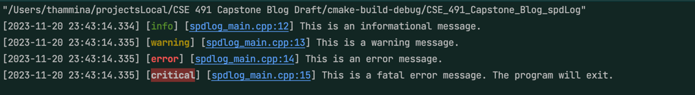

# Blog Post for Logging in C++
author: Aman Dhruva Thamminana

## Introduction: What is Logging?
Whether you are one is just staring of in their programming journey or a seasoned programmer, 
you would have used print statements to debug your code. Logging is very similar to print states of code but with more tools
to help better understand the state of the program. Logging can be a very useful tool to level up one;'s programming skills.

In simple terms logging is the act of  recording events, actions, or states that occur during the execution of a program.

Let's look into understanding the basics of logging in C++ and looking into spdlog and glog libraries.

## Back to Basics:  Why is Logging Important?
Logging helps us understand what is happening to a program under the hood. This can be very crutial
especially at scale like when working on a large code base or when running high and long computing programs.
Understading this information can allow us to create error free, efficient and robust code. 

Logging has become an indispensable standard in the software industry. In real-world many applications in  ios, android, and web and software platforms themselves use logging to record information about their operations. 
. These detailed records enable developers to understand the context of issues, replicate scenarios,
and create fixes.

### How Logging Differs from Print Statements?

Print statements can be used as a simpler version of logging allowing the programer to display several states of the program.
Unlike print statements logging provides several syntatical levels of capturing information. 

Although it is upto the library to provide these levels, some of the common levels are:
- Debug: Information that is critical to debug an application.
- Info: Informational messages that highlight the progress of the application.
- Warning: Indicates a potential problem that is not terminal to the application.
- Error: Indicates a serious error that may prevent the application from continuing to run.

Logging also provides the ability to log to different outputs like files, console, etc. This can be useful when running a program on a remote locations.

### spdlog 💨 💨

spdlog is a very popular logging library for C++. It is a header only library built to be fast and efficient. 

to install in macos I have run these steps
```bash
brew install spdlog
```

to add it to cmake
```cmake
find_package(glog REQUIRED)

add_executable(CSE_491_Capstone_Blog_Draft main.cpp)
target_link_libraries(CSE_491_Capstone_Blog_Draft glog::glog)
```

and to get started with spdlog in your cpp project
```cpp
#include <spdlog/spdlog.h>
```

Here is a simple code snippet to get started with spdlog
```cpp
#include <spdlog/spdlog.h>

void sampleFunction() {
    // Initialize spdlog
    auto logger = spdlog::default_logger();

    // Set log level (equivalent to controlling INFO, WARNING, ERROR, FATAL in glog)
    logger->set_level(spdlog::level::trace); // This will allow all levels of logging

    // Log messages
    SPDLOG_INFO("This is an informational message.");
    SPDLOG_WARN("This is a warning message.");
    SPDLOG_ERROR("This is an error message.");
    SPDLOG_CRITICAL("This is a fatal error message. The program will exit.");
  
    // In spdlog, there's no need for explicit shutdown like in Google Logging.
    // It will automatically flush and shutdown on program exit.
}
```

which will output
```bash

[2023-11-20 23:43:14.334] [info] [spdlog_main.cpp:12] This is an informational message.
[2023-11-20 23:43:14.335] [warning] [spdlog_main.cpp:13] This is a warning message.
[2023-11-20 23:43:14.335] [error] [spdlog_main.cpp:14] This is an error message.
[2023-11-20 23:43:14.335] [critical] [spdlog_main.cpp:15] This is a fatal error message. The program will exit.
```

just more colorful and pretty.


#### Named Logging
spdlog allows you to create multiple loggers with different names. This can be useful when you want to log different parts of your application to different files or streams.
```cpp
#include "spdlog/spdlog.h"
#include "spdlog/sinks/stdout_color_sinks.h"

void stdout_example()
{
  // create a color multi-threaded logger
  auto console = spdlog::stdout_color_mt("console");
  auto err_logger = spdlog::stderr_color_mt("stderr");
  spdlog::get("console")->info("loggers can be retrieved from a global registry using the spdlog::get(logger_name)");
  spdlog::get("stderr")->info("loggers can be retrieved from a global registry using the spdlog::get(logger_name)");
}
```

which outputs
```bash
[2023-11-20 23:47:38.197] [console] [info] loggers can be retrieved from a global registry using the spdlog::get(logger_name)
[2023-11-20 23:47:38.198] [stderr] [info] loggers can be retrieved from a global registry using the spdlog::get(logger_name)
```


Here is an example for logging to a file
```cpp

#include <iostream>

#include "spdlog/spdlog.h"
#include "spdlog/sinks/basic_file_sink.h"
void basic_logfile_example()
{
  try
  {
    auto logger = spdlog::basic_logger_mt("basic_logger", "logs/basic-log.txt");
  }
  catch (const spdlog::spdlog_ex &ex)
  {
    std::cout << "Log init failed: " << ex.what() << std::endl;
  }
}

```

more advanced logging can also be done with spdlog. 

```cpp
#include "spdlog/sinks/rotating_file_sink.h"
void rotating_example()
{
    // Create a file rotating logger with 5 MB size max and 3 rotated files
    auto max_size = 1048576 * 5;
    auto max_files = 3;
    auto logger = spdlog::rotating_logger_mt("some_logger_name", "logs/rotating.txt", max_size, max_files);
}
```
This demonstrates the creation of a rotating file logger using the spdlog library in C++. It configures a logger named "some_logger_name" to write to "logs/rotating.txt", with a maximum file size of 5 MB and a limit of 3 rotated files.


```cpp
#include "spdlog/sinks/daily_file_sink.h"
void daily_example()
{
    // Create a daily logger - a new file is created every day at 2:30 am
    auto logger = spdlog::daily_logger_mt("daily_logger", "logs/daily.txt", 2, 30);
}
```

and ability to log trace and flush periodically
```cpp
spdlog::enable_backtrace(32); 

for(int i = 0; i < 100; i++)
{
  spdlog::debug("Backtrace message {}", i); 
}
// if some error happened
spdlog::dump_backtrace(); 

spdlog::flush_every(std::chrono::seconds(3));
```

These are some of the basic features of spdlog. There are a many more features that can be found in the documentation.

### glog (🔵🔴🟠🟢)
The Google Logging Library (glog) is a robust and efficient logging library for C++ applications developed by Google. 
It is designed for ease of use and high performance, making it a popular choice among developers.

to install in macos I have run these steps
```bash
brew install glog
```

to add it to cmake
```cmake
find_package(glog REQUIRED)

add_executable(CSE_491_Capstone_Blog_Draft main.cpp)
target_link_libraries(CSE_491_Capstone_Blog_Draft glog::glog)
```


and to get started with glog in your cpp project
```cpp
#include <glog/logging.h>
```

Here is a simple code snippet to get started with glog
```cpp
#include <glog/logging.h>

void samplefunction() {
  // Initialize Google Logging
  google::InitGoogleLogging("Aman's Blogpost");

  // Set log destination to console (stderr).
  google::LogToStderr();

  // Log messages
  LOG(INFO) << "This is an informational message.";
  LOG(WARNING) << "This is a warning message.";
  LOG(ERROR) << "This is an error message.";
  LOG(FATAL) << "This is a fatal error message. The program will exit.";
  

  // Clean up and shutdown Google Logging
  google::ShutdownGoogleLogging();
  
}
```

which will output
```bash
I20231016 23:59:25.775111 3685077760 main.cpp:18] This is an informational message.
W20231016 23:59:25.775573 3685077760 main.cpp:19] This is a warning message.
E20231016 23:59:25.775576 3685077760 main.cpp:20] This is an error message.
E20231016 23:59:25.775578 3685077760 main.cpp:24] Encountered  errors.

Process finished with exit code 0
```


to break down the code snippet above
```
I20231016 23:59:25.775111 3685077760 main.cpp:18]
```
- I: INFO
- 20231016: Date
- 23:59:25.775111: Time
- 3685077760: Thread ID (PID )
- main.cpp:18: File name and line number
- contents of the log message itself


#### Conditional Logging

```cpp
#include <glog/logging.h>

void PerformTask(int value) {
    // Log a message if the input value is greater than 10.
    LOG_IF(INFO, value > 10) << "Value is greater than 10: " << value;
    
    // Log a message if the input value is even.
    LOG_IF(WARNING, value % 2 == 0) << "Value is even: " << value;
}

int main(int argc, char* argv[]) {
    // Initialize glog. This should be called once in your program.
    google::InitGoogleLogging(argv[0]);

    int value1 = 7;
    int value2 = 12;

    // Call PerformTask with different values.
    PerformTask(value1);
    PerformTask(value2);

    // Clean up and shutdown glog.
    google::ShutdownGoogleLogging();

    return 0;
}
```

which does not output value. (strange)
but can conditionally output immediate string messages.


here is another example

```cpp
#include <glog/logging.h>

void ConditionalLoggingExample(int value) {
  LOG_IF(INFO, value > 10) << "Logging an informational message (condition met).";
  LOG_IF(INFO, value <= 10) << "Logging an informational message (condition not met).";

  int verbosity_level = 2;
  VLOG_IF(verbosity_level, value > 10) << "Verbose log message (condition met).";
  VLOG_IF(verbosity_level, value <= 10) << "Verbose log message (condition not met).";
}

int main(int argc, char* argv[]) {
  google::InitGoogleLogging(argv[0]);

  // Set log destination to console (stderr).
  google::LogToStderr();

  int value = 15;
  ConditionalLoggingExample(value);

  google::ShutdownGoogleLogging();
  return 0;
}
```

which outputs
```bash
I20231018 00:18:04.219352 3685077760 main.cpp:4] Logging an informational message (condition met).
I20231018 00:18:04.219790 3685077760 main.cpp:4] Logging an informational message (condition met).
I20231018 00:18:04.219794 3685077760 main.cpp:8] Verbose log message (condition met).
```

There are a many more macros...

#### `LOG_EVERY_N`
The LOG_EVERY_N macro allows you to log a message every N occurrences. This can be helpful when you want to log messages periodically or at specific intervals. 
```cpp
void samplefunction() {
    LOG_EVERY_N(INFO, 5) << "Logging every 5th call of samplefunction.";
}
```

#### `LOG_FIRST_N`
LOG_IF_EVERY_N combines conditional and periodic logging. It logs a message every N occurrences only if a specific condition is met.
```cpp
void samplefunction() {
    LOG_IF_EVERY_N(INFO, value > 10, 5) << "Logging every 5th call of samplefunction if value > 10.";
}
```

#### `LOG_FIRST_N`
LOG_FIRST_N allows you to log a message only for the first N occurrences.
```cpp
void samplefunction() {
    LOG_FIRST_N(INFO, 5) << "Logging only the first 5 calls of samplefunction.";
}
```

#### `LOG_EVERY_T`
LOG_EVERY_T enables you to log a message every T seconds. This is beneficial when you want to log periodic updates 
```cpp
void samplefunction() {
    LOG_EVERY_T(INFO, 5) << "Logging every 5 seconds.";
}
```

#### `CHECK`
The CHECK macro verifies a condition and logs a FATAL message if the condition is false
```cpp
void samplefunction() {
    CHECK(value > 10) << "Value is not greater than 10.";
}
```

** A number of these macros can also be called with D[MACRO] allowing to only run macros in debug mode and not in release.**


## Good Practices for Logging
from my research I have found a few good practices for logging.

- Choosing appropriate log levels and verbosity level for each log message.
- Ability to structure log messages appropriately.
- Gather and store initial context information of the systems.
- be cautious of logging sensitive information like credientials.


## Conclusion
In the course of exploring logging libraries like spdlog and glog,
I've encountered a lot of features and practices that have significantly enhanced 
my understanding of effective logging in C++.
As I continue to develop my own logging system, I have started to incorporate some of these features and practices.

Moving beyond simple print statements, logging can be a very useful tool to level up one's programming skills.

References:
- https://github.com/gabime/spdlog
- https://github.com/google/glog


