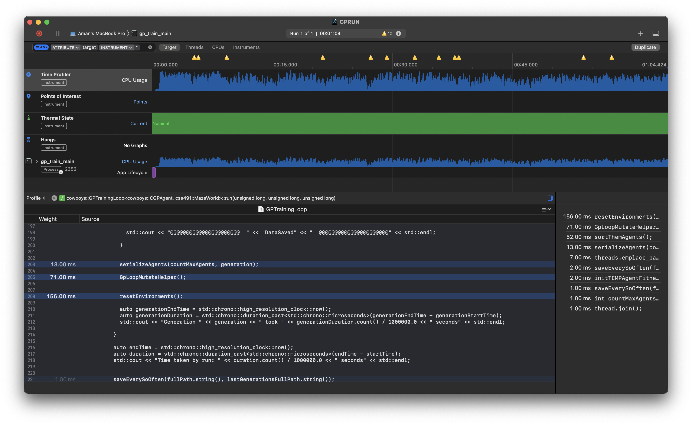
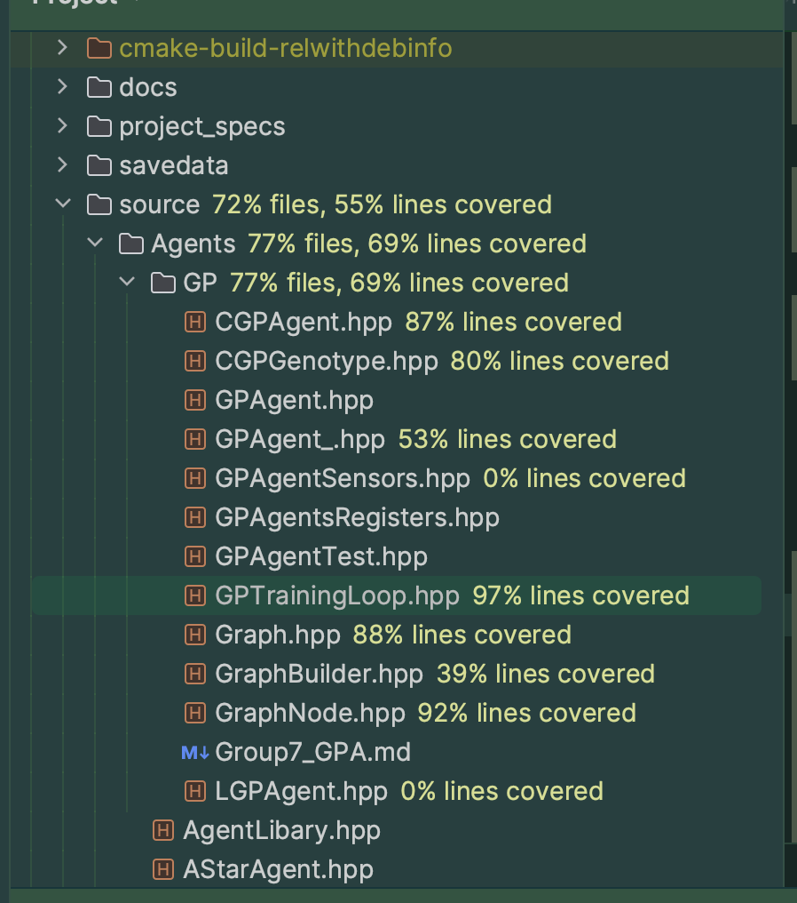
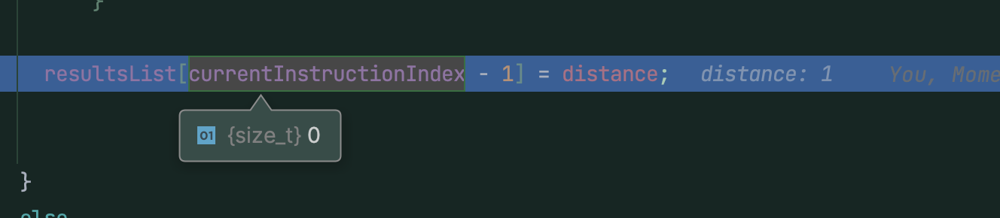

# Group 7 : Genetic Programming Agents
-- --
authors: Aman, Simon, Rajmeet, Jason

(Img: Rajmeet, Simon, Jason, Aman) 

## Introduction

## GP Agent Base Class

## LGP Agent

## CGP Agent

## GP Loop

## It runs on my machine
we have used cmake to ensure that our code compiles on all platforms. but....
we have tested our code on the following machines/architectures:
- Windows 11
- Windows 10
- Ubuntu 20.04
- HPCC Cluster Centos7
- MacOS Sonoma (ARM)
- mlcollard/linux-dev (Docker Container)

Tested in the following IDEs:
- CLion
- VSCode

Tested on the following compilers:
- gcc 9.3.0
- Apple clang 12.0.0
- LLVM clang 11.0.0

### Profiled with and optimized with:
- clion profiler
 /

- Xcode instruments
 

- intel vtune
 

- very sleepy
Didnt deserve a screenshot. /s

- code coverage in clion
  

### Sanitized with:

- clang sanitizer Memory
- valgrind
- gcc sanitizer Memory
- gcc sanitizer address
  - Used to find and fix memory UB in the code.
  

## Other Contributions

### EasyLogging
Created a logging class that is can be used to log debug messages in debug mode. Teams can be specified to log with different levels of verbosity. This is useful for debugging and profiling.

### CMake
Initial cmake setup for the project. This is useful for cross platform compilation and testing.

### serializationUsingTinyXML2
Created and tested a serialization class that can be used to serialize and deserialize objects to and from xml files. This is useful for saving and loading the state of the GP agents.
Implemented serialization pattern using tinyxml2 library.

### mkdocs documentation
Created and tested a mkdocs documentation for the project. This is useful for creating a website for the project.