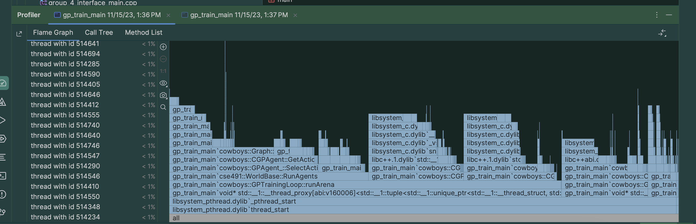

# Group 7 : Genetic Programming Agents
-- --
authors: Aman, Simon, Rajmeet, Jason

(Img: Rajmeet, Simon, Jason, Aman) 

## Introduction

## GP Agent Base Class

## LGP Agent

## CGP Agent

## GP Loop

## It runs on my machine
we have used cmake to ensure that our code compiles on all platforms. but....
we have tested our code on the following machines/architectures:
- Windows 11
- Windows 10
- Ubuntu 20.04
- HPCC Cluster Centos7
- MacOS Sonoma (ARM)

### Profiled with and optimzed with:
- clion profiler
 

- Xcode instruments
 

- intel vtune
 

- very sleepy
Didnt deserve a screenshot. /s

## Other Contributions

### EasyLogging

### CMake

### serializationUsingTinyXML2

### mkdocs documentation
